# Objectives

- Reading data in R
- Data manipulation and exploration
- Visualisation

---

Parts of the `data.frame` and `ggplot2` material are based on the
[R for data analysis and visualization](http://www.datacarpentry.org/R-ecology-lesson/index.html)
Data Carpentry course.


# Part 1: Data analysis

## Reading in data

The file we'll be reading in is a dataset that has been 1) processed
in Skyline and 2) summarized by each run and protein with
`MSstats`. We will practice with it.

**Tip** Often you'll get data delivered as a Microsoft Excel file. You
can export any spreadsheet to a `.csv` (comma separated values) file
in Excel through the `Save As.. > Format: Comma Separated Values
(.csv)` menu item.

In Rstudio, go to the `environnment` pane, click on `Import Dataset`
dropdown and choose `From Text File...` from the dropdown menu. Import
the `iPRG_example_runsummary.csv` file from your data directory, and
inspect that Rstudio correctly parsed the text file into an R
`data.frame`.


Now inspect the `Console` `Environment` pane again. Notice that a new
variable for the `iPRG_example` data frame was created in the
environment by executing the `read.csv` function. Let's have a look at
the documentation for this function by pulling up the help pages with
the `?`.


```r
iprg <- read.csv("./data/iPRG_example_runsummary.csv")
```

## Data frames

### Tidy data

The `iprg` object that we created is a `data.frame`


```r
class(iprg)
```

```
## [1] "data.frame"
```

These object are the equivalent of a sheet in a spreadsheet file. They
are composed on a set of columns, which are different vectors (or
characters, numerics, factors, ...) as seen previously.

There are actually some additional cont strains compared to a
spreadsheet. Rather than being limitations, these constrains are an
important feature that allow some standardisation and hence automatic
computations.

* All the data in a `data.frame` must be included in a column, as a
  vector. This means that it's not possible to add *random* notes or
  values, as is sometimes seen in spreadsheets.

* All columns/vectors must have the same length, as opposed to
  spreadsheets, where sometimes some values or summary statistics are
  added at the bottom.

* No colours or font decorations.

This leads us to a very important concept in data formatting and data
manipulation, which is that data should be *tidy*, where

* Columns describe different variables
* Rows describe different observations
* A cell contains a measurement or piece of information for a single
  observation.

There are two important reasons that we want tidy data

1. No need to tidy it up, which is a task many of us waste way to much
   time with.
2. The data is well structured, easy to read in, whatever the software
   or programming languages, and is easy to reason about.


Note that data is always tidy, and for good reasons so. For example,
omics data is often presented as shown below


|                                | JD_06232014_sample1-A.raw| JD_06232014_sample1_B.raw|
|:-------------------------------|-------------------------:|-------------------------:|
|sp&#124;D6VTK4&#124;STE2_YEAST  |                  26.58301|                  26.81232|
|sp&#124;O13297&#124;CET1_YEAST  |                  24.71809|                  24.71912|
|sp&#124;O13329&#124;FOB1_YEAST  |                  23.47075|                  23.37678|
|sp&#124;O13539&#124;THP2_YEAST  |                  24.29661|                  27.52021|
|sp&#124;O13547&#124;CCW14_YEAST |                  27.11638|                  27.22234|

which is not strictly tidy, as the protein intensity is presented along
multiple columns. Some situations lend themselves more to a long or
wide format (as we will see later), but the data should never be
*messy*, as for example below:

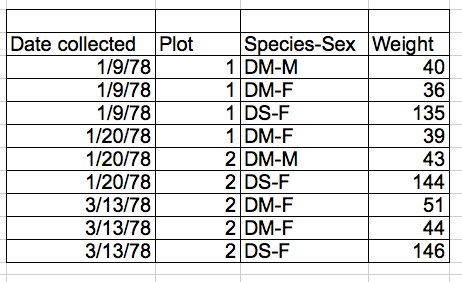


> **Challenge**
>
> Compare the structure of the data presented above (loaded from the
> `iprg2.rda` files) and the `iprg` data.

### What are data frames?

Data frames are the _de facto_ data structure for most tabular data, and what we
use for statistics and plotting.

A data frame can be created by hand, but most commonly they are generated by the
functions `read.csv()` or `read.table()`; in other words, when importing
spreadsheets from your hard drive (or the web).

A data frame is the representation of data in the format of a table where the
columns are vectors that all have the same length. Because the column are
vectors, they all contain the same type of data (e.g., characters, integers,
factors). We can see this when inspecting the <b>str</b>ucture of a data frame
with the function `str()`:


```r
str(iprg)
```

```
## 'data.frame':	36321 obs. of  7 variables:
##  $ Protein      : Factor w/ 3027 levels "sp|D6VTK4|STE2_YEAST",..: 1 1 1 1 1 1 1 1 1 1 ...
##  $ Log2Intensity: num  26.8 26.6 26.6 26.8 26.8 ...
##  $ Run          : Factor w/ 12 levels "JD_06232014_sample1-A.raw",..: 2 3 1 4 5 6 7 8 9 11 ...
##  $ Condition    : Factor w/ 4 levels "Condition1","Condition2",..: 1 1 1 2 2 2 3 3 3 4 ...
##  $ BioReplicate : int  1 1 1 2 2 2 3 3 3 4 ...
##  $ Intensity    : num  1.18e+08 1.02e+08 1.01e+08 1.20e+08 1.16e+08 ...
##  $ TechReplicate: Factor w/ 3 levels "A","B","C": 2 3 1 1 2 3 1 2 3 2 ...
```

### Inspecting `data.frame` objects

We already saw how the functions `head()` and `str()` can be useful to check the
content and the structure of a data frame. Here is a non-exhaustive list of
functions to get a sense of the content/structure of the data. Let's try them out!

* Size:
	* `dim(iprg)` - returns a vector with the number of rows in the first element,
		  and the number of columns as the second element (the **dim**ensions of
		  the object)
	* `nrow(iprg)` - returns the number of rows
	* `ncol(iprg)` - returns the number of columns

* Content:
	* `head(iprg)` - shows the first 6 rows
	* `tail(iprg)` - shows the last 6 rows

* Names:
	* `names(iprg)` - returns the column names (synonym of `colnames()` for `data.frame`
	   objects)
	* `rownames(iprg)` - returns the row names

* Summary:
	* `str(iprg)` - structure of the object and information about the class, length and
	   content of  each column
	* `summary(iprg)` - summary statistics for each column

Note: most of these functions are "generic", they can be used on other types of
objects besides `data.frame`.


> **Challenge**
>
> Based on the output of `str(iprg)`, can you answer the following questions?
>
> * What is the class of the object `iprg`?
> * How many rows and how many columns are in this object?
> * How many proteins have been assayed?

### Indexing and subsetting data frames

Our data frame has rows and columns (it has 2 dimensions), if we want
to extract some specific data from it, we need to specify the
*coordinates* we want from it. Row numbers come first, followed by
column numbers. However, note that different ways of specifying these
coordinates lead to results with different classes.


```r
iprg[1]      # first column in the data frame (as a data.frame)
iprg[, 1]    # first column in the data frame (as a vector)
iprg[1, 1]   # first element in the first column of the data frame (as a vector)
iprg[1, 6]   # first element in the 6th column (as a vector)
iprg[1:3, 3] # first three elements in the 3rd column (as a vector)
iprg[3, ]    # the 3rd element for all columns (as a data.frame)
head_iprg <- iprg[1:6, ] # equivalent to head(iprg)
```

`:` is a special function that creates numeric vectors of integers in
increasing or decreasing order, test `1:10` and `10:1` for instance.

You can also exclude certain parts of a data frame using the `-` sign:


```r
iprg[, -1]          # The whole data frame, except the first column
iprg[-c(7:36321), ] # Equivalent to head(iprg)
```

As well as using numeric values to subset a `data.frame` columns can
be called by name, using one of the four following notations:


```r
iprg["Protein"]       # Result is a data.frame
iprg[, "Protein"]     # Result is a vector
iprg[["Protein"]]     # Result is a vector
iprg$Protein          # Result is a vector
```

For our purposes, the last three notations are equivalent. RStudio
knows about the columns in your data frame, so you can take advantage
of the autocompletion feature to get the full and correct column name.

> **Challenge**
>
> 1. Create a `data.frame` (`iprg_200`) containing only the observations from
>    row 200 of the `iprg` dataset.
>
> 2. Notice how `nrow()` gave you the number of rows in a `data.frame`?
>
>      * Use that number to pull out just that last row in the data frame.
>      * Compare that with what you see as the last row using `tail()` to make
>        sure it's meeting expectations.
>      * Pull out that last row using `nrow()` instead of the row number.
>      * Create a new data frame object `iprg_last` from that last row.
>
> 3. Extract the row that is in the middle of the data frame. Store
>    the content of this row in an object named `iprg_middle`.
>
> 4. Combine `nrow()` with the `-` notation above to reproduce the behavior of
>    `head(iprg)` keeping just the first through 6th rows of the `iprg`
>    dataset.

<details>

```r
## 1.
iprg_200 <- iprg[200, ]

## 2.
iprg_last <- iprg[nrow(iprg), ]

## 3.
(i <- floor(nrow(iprg)/2))
```

```
## [1] 18160
```

```r
iprg_middle <- iprg[i, ]

## 4.
iprg[-(7:nrow(iprg)), ]
```

```
##                Protein Log2Intensity                       Run  Condition
## 1 sp|D6VTK4|STE2_YEAST      26.81232 JD_06232014_sample1_B.raw Condition1
## 2 sp|D6VTK4|STE2_YEAST      26.60786 JD_06232014_sample1_C.raw Condition1
## 3 sp|D6VTK4|STE2_YEAST      26.58301 JD_06232014_sample1-A.raw Condition1
## 4 sp|D6VTK4|STE2_YEAST      26.83563 JD_06232014_sample2_A.raw Condition2
## 5 sp|D6VTK4|STE2_YEAST      26.79430 JD_06232014_sample2_B.raw Condition2
## 6 sp|D6VTK4|STE2_YEAST      26.60863 JD_06232014_sample2_C.raw Condition2
##   BioReplicate Intensity TechReplicate
## 1            1 117845016             B
## 2            1 102273602             C
## 3            1 100526837             A
## 4            2 119765106             A
## 5            2 116382798             B
## 6            2 102328260             C
```
</details>

## Factors


When we did `str(iprg)` we saw that several of the columns consist of
numerics, however, the columns `Protein`, `Run`, and `Condition`, are
of a special class called a `factor`. Factors are very useful and are
actually something that make R particularly well suited to working
with data, so we're going to spend a little time introducing them.

Factors are used to represent categorical data. Factors can be ordered
or unordered, and understanding them is necessary for statistical
analysis and for plotting.

Factors are stored as integers, and have labels (text) associated with
these unique integers. While factors look (and often behave) like
character vectors, they are actually integers under the hood, and you
need to be careful when treating them like strings.

Once created, factors can only contain a pre-defined set of values,
known as *levels*. By default, R always sorts *levels* in alphabetical
order. For instance, if you have a factor with 2 levels:


```r
sex <- factor(c("male", "female", "female", "male"))
```

R will assign `1` to the level `"female"` and `2` to the level
`"male"` (because `f` comes before `m`, even though the first element
in this vector is `"male"`). You can check this by using the function
`levels()`, and check the number of levels using `nlevels()`:


```r
levels(sex)
```

```
## [1] "female" "male"
```

```r
nlevels(sex)
```

```
## [1] 2
```

Sometimes, the order of the factors does not matter, other times you
might want to specify the order because it is meaningful (e.g., "low",
"medium", "high"), it improves your visualization, or it is required
by a particular type of analysis. Here, one way to reorder our levels
in the `sex` vector would be:


```r
sex # current order
```

```
## [1] male   female female male  
## Levels: female male
```

```r
sex <- factor(sex, levels = c("male", "female"))
sex # after re-ordering
```

```
## [1] male   female female male  
## Levels: male female
```

In R's memory, these factors are represented by integers (1, 2, 3),
but are more informative than integers because factors are self
describing: `"female"`, `"male"` is more descriptive than `1`,
`2`. Which one is "male"?  You wouldn't be able to tell just from the
integer data. Factors, on the other hand, have this information built
in. It is particularly helpful when there are many levels (like the
species names in our example dataset).

### Converting factors

If you need to convert a factor to a character vector, you use
`as.character(x)`.


```r
as.character(sex)
```

```
## [1] "male"   "female" "female" "male"
```

### Using `stringsAsFactors=FALSE`

By default, when building or importing a data frame, the columns that
contain characters (i.e., text) are coerced (=converted) into the
`factor` data type. Depending on what you want to do with the data,
you may want to keep these columns as `character`. To do so,
`read.csv()` and `read.table()` have an argument called
`stringsAsFactors` which can be set to `FALSE`.

In most cases, it's preferable to set `stringsAsFactors = FALSE` when
importing your data, and converting as a factor only the columns that
require this data type.

> **Challenge**
>
> Compare the output of `str(surveys)` when setting `stringsAsFactors
> = TRUE` (default) and `stringsAsFactors = FALSE`:

<details>

```r
iprg <- read.csv("data/iPRG_example_runsummary.csv", stringsAsFactors = TRUE)
str(iprg)
```

```
## 'data.frame':	36321 obs. of  7 variables:
##  $ Protein      : Factor w/ 3027 levels "sp|D6VTK4|STE2_YEAST",..: 1 1 1 1 1 1 1 1 1 1 ...
##  $ Log2Intensity: num  26.8 26.6 26.6 26.8 26.8 ...
##  $ Run          : Factor w/ 12 levels "JD_06232014_sample1-A.raw",..: 2 3 1 4 5 6 7 8 9 11 ...
##  $ Condition    : Factor w/ 4 levels "Condition1","Condition2",..: 1 1 1 2 2 2 3 3 3 4 ...
##  $ BioReplicate : int  1 1 1 2 2 2 3 3 3 4 ...
##  $ Intensity    : num  1.18e+08 1.02e+08 1.01e+08 1.20e+08 1.16e+08 ...
##  $ TechReplicate: Factor w/ 3 levels "A","B","C": 2 3 1 1 2 3 1 2 3 2 ...
```

```r
iprg <- read.csv("data/iPRG_example_runsummary.csv", stringsAsFactors = FALSE)
str(iprg)
```

```
## 'data.frame':	36321 obs. of  7 variables:
##  $ Protein      : chr  "sp|D6VTK4|STE2_YEAST" "sp|D6VTK4|STE2_YEAST" "sp|D6VTK4|STE2_YEAST" "sp|D6VTK4|STE2_YEAST" ...
##  $ Log2Intensity: num  26.8 26.6 26.6 26.8 26.8 ...
##  $ Run          : chr  "JD_06232014_sample1_B.raw" "JD_06232014_sample1_C.raw" "JD_06232014_sample1-A.raw" "JD_06232014_sample2_A.raw" ...
##  $ Condition    : chr  "Condition1" "Condition1" "Condition1" "Condition2" ...
##  $ BioReplicate : int  1 1 1 2 2 2 3 3 3 4 ...
##  $ Intensity    : num  1.18e+08 1.02e+08 1.01e+08 1.20e+08 1.16e+08 ...
##  $ TechReplicate: chr  "B" "C" "A" "A" ...
```
</details>

## Other data structures

|          | dimensions | number of types |
|:---------|------------|-----------------|
| `vector` |       1    |       1         |
| `matrix` |       2    |       1         |
| `array`  |     any    |       1         |
|`data.frame`|       2    | 1 per colums    |
| `list`   | 1 (length) | any             |

## Data exploration

Let's explore some basic properties of our dataset. Go to the RStudio
Environment pane and double click the `iPRG_example` entry. This data
is in tidy, long format, which is an easier data format for data
manipulation operations such as selecting, grouping, summarizing, etc.

Data exported out of many omics processing or quantification tools are
often formatted in *wide* format, which is easier to read when we
would like to compare values (i.e intensity values) for specific
subjects (i.e peptides) across different values for a variable of
interest such as (i.e conditions). We'll format a summary of this
dataset as a 'wide' data frame later in this tutorial.

Let's do some more data exploration by examining how R read in the
iPRG dataset.


> **Challenge**
>
> Explore the data as described below
>
> * What is the *class* of the variable?
> * What dimension is it? How many rows and columns does it have?
> * What variables (column names) do we have?
> * Look at the few first and last lines to make sure the data was
>   imported correctly.
> * Display a summary of the whole data.

Let's now inspect the possible values for the `Conditions` and the
`BioReplicate` columns. To aswer the questions, below, we will need to
use the `unique` function. From the manual page, we learn that

```
'unique' returns a vector, data frame or array like 'x' but with
duplicate elements/rows removed.
```

For example


```r
unique(c(1, 2, 4, 1, 1, 2, 3, 3, 4, 1))
```

```
## [1] 1 2 4 3
```

```r
unique(c("a", "b", "a"))
```

```
## [1] "a" "b"
```


```r
dfr <- data.frame(x = c(1, 1, 2),
				  y = c("a", "a", "b"))
dfr
```

```
##   x y
## 1 1 a
## 2 1 a
## 3 2 b
```

```r
unique(dfr)
```

```
##   x y
## 1 1 a
## 3 2 b
```

> **Challenge**
>
> 1. How many conditions are there?
> 2. How many biological replicates are there?
> 3. How many condition/technical replicates combinations are there?

<details>


```r
## 1.
unique(iprg$Condition)
```

```
## [1] "Condition1" "Condition2" "Condition3" "Condition4"
```

```r
length(unique(iprg$Condition))
```

```
## [1] 4
```

```r
## 2.
unique(iprg$BioReplicate)
```

```
## [1] 1 2 3 4
```

```r
length(unique(iprg$BioReplicate))
```

```
## [1] 4
```

```r
## 3.
unique(iprg$Condition)
```

```
## [1] "Condition1" "Condition2" "Condition3" "Condition4"
```

```r
unique(iprg$BioReplicate)
```

```
## [1] 1 2 3 4
```

```r
unique(iprg[, c("Condition", "TechReplicate")])
```

```
##     Condition TechReplicate
## 1  Condition1             B
## 2  Condition1             C
## 3  Condition1             A
## 4  Condition2             A
## 5  Condition2             B
## 6  Condition2             C
## 7  Condition3             A
## 8  Condition3             B
## 9  Condition3             C
## 10 Condition4             B
## 11 Condition4             C
## 12 Condition4             A
```
</details>

It is often useful to start a preliminary analysis, or proceed with a
more detailed data exploration using a smalle subset of the data.

> **Challenge**
>
> Select subsets of rows from iPRG dataset. Let's focus on
>
> * Condition 1 only
> * Condition 1 and TechReplicate A
> * all measurements on one particular MS run.
> * Conditions 1 and 2
>
> For each of there, how many measurements are there?

<details>

```r
iprg_c1 <- iprg[iprg$Condition == "Condition1", ]
head(iprg_c1)
```

```
##                 Protein Log2Intensity                       Run  Condition
## 1  sp|D6VTK4|STE2_YEAST      26.81232 JD_06232014_sample1_B.raw Condition1
## 2  sp|D6VTK4|STE2_YEAST      26.60786 JD_06232014_sample1_C.raw Condition1
## 3  sp|D6VTK4|STE2_YEAST      26.58301 JD_06232014_sample1-A.raw Condition1
## 13 sp|O13297|CET1_YEAST      24.71912 JD_06232014_sample1_B.raw Condition1
## 14 sp|O13297|CET1_YEAST      24.67437 JD_06232014_sample1_C.raw Condition1
## 15 sp|O13297|CET1_YEAST      24.71809 JD_06232014_sample1-A.raw Condition1
##    BioReplicate Intensity TechReplicate
## 1             1 117845016             B
## 2             1 102273602             C
## 3             1 100526837             A
## 13            1  27618234             B
## 14            1  26774670             C
## 15            1  27598550             A
```

```r
nrow(iprg_c1)
```

```
## [1] 9079
```

```r
iprg_c1A <- iprg[iprg$Condition == "Condition1" & iprg$TechReplicate == "A", ]
head(iprg_c1A)
```

```
##                  Protein Log2Intensity                       Run
## 3   sp|D6VTK4|STE2_YEAST      26.58301 JD_06232014_sample1-A.raw
## 15  sp|O13297|CET1_YEAST      24.71809 JD_06232014_sample1-A.raw
## 27  sp|O13329|FOB1_YEAST      23.47075 JD_06232014_sample1-A.raw
## 39  sp|O13539|THP2_YEAST      24.29661 JD_06232014_sample1-A.raw
## 51 sp|O13547|CCW14_YEAST      27.11638 JD_06232014_sample1-A.raw
## 63 sp|O13563|RPN13_YEAST      26.17056 JD_06232014_sample1-A.raw
##     Condition BioReplicate Intensity TechReplicate
## 3  Condition1            1 100526837             A
## 15 Condition1            1  27598550             A
## 27 Condition1            1  11625198             A
## 39 Condition1            1  20606703             A
## 51 Condition1            1 145493943             A
## 63 Condition1            1  75530595             A
```

```r
nrow(iprg_c1A)
```

```
## [1] 3026
```

```r
iprg_r1 <- iprg[iprg$Run == "JD_06232014_sample1_B.raw", ]
head(iprg_r1)
```

```
##                  Protein Log2Intensity                       Run
## 1   sp|D6VTK4|STE2_YEAST      26.81232 JD_06232014_sample1_B.raw
## 13  sp|O13297|CET1_YEAST      24.71912 JD_06232014_sample1_B.raw
## 25  sp|O13329|FOB1_YEAST      23.37678 JD_06232014_sample1_B.raw
## 37  sp|O13539|THP2_YEAST      27.52021 JD_06232014_sample1_B.raw
## 49 sp|O13547|CCW14_YEAST      27.22234 JD_06232014_sample1_B.raw
## 61 sp|O13563|RPN13_YEAST      26.09476 JD_06232014_sample1_B.raw
##     Condition BioReplicate Intensity TechReplicate
## 1  Condition1            1 117845016             B
## 13 Condition1            1  27618234             B
## 25 Condition1            1  10892143             B
## 37 Condition1            1 192490784             B
## 49 Condition1            1 156581624             B
## 61 Condition1            1  71664672             B
```

```r
nrow(iprg_r1)
```

```
## [1] 3026
```

```r
iprg_c12 <- iprg[iprg$Condition %in% c("Condition1", "Condition2"), ]
head(iprg_c12)
```

```
##                Protein Log2Intensity                       Run  Condition
## 1 sp|D6VTK4|STE2_YEAST      26.81232 JD_06232014_sample1_B.raw Condition1
## 2 sp|D6VTK4|STE2_YEAST      26.60786 JD_06232014_sample1_C.raw Condition1
## 3 sp|D6VTK4|STE2_YEAST      26.58301 JD_06232014_sample1-A.raw Condition1
## 4 sp|D6VTK4|STE2_YEAST      26.83563 JD_06232014_sample2_A.raw Condition2
## 5 sp|D6VTK4|STE2_YEAST      26.79430 JD_06232014_sample2_B.raw Condition2
## 6 sp|D6VTK4|STE2_YEAST      26.60863 JD_06232014_sample2_C.raw Condition2
##   BioReplicate Intensity TechReplicate
## 1            1 117845016             B
## 2            1 102273602             C
## 3            1 100526837             A
## 4            2 119765106             A
## 5            2 116382798             B
## 6            2 102328260             C
```

```r
nrow(iprg_c12)
```

```
## [1] 18160
```
</details>

# Part 2: Manipulating and analyzing data woth `dplyr`

> The following material is based on Data Carpentry's the
> [Data analisis and visualisation](http://www.datacarpentry.org/R-ecology-lesson/) lessons.


Learning Objectives:

* Understand the purpose of the **`dplyr`** package.
* Select certain columns in a data frame with the **`dplyr`** function `select`.
* Select certain rows in a data frame according to filtering
  conditions with the **`dplyr`** function `filter` .
* Link the output of one **`dplyr`** function to the input of another function with the 'pipe' operator.
* Add new columns to a data frame that are functions of existing columns with `mutate`.
* Understand the split-apply-combine concept for data analysis.
* Use `summarize`, `group_by`, and `tally` to split a data frame into groups
  of observations, apply a summary statistics for each group, and then
  combine the results.


Bracket subsetting is handy, but it can be cumbersome and difficult to
read, especially for complicated operations. Enter
**`dplyr`**. **`dplyr`** is a package for making tabular data
manipulation easier. It pairs nicely with **`tidyr`** which enables
you to swiftly convert between different data formats for plotting and
analysis.

Packages in R are basically sets of additional functions that let you
do more stuff. The functions we've been using so far, like `str()` or
`data.frame()`, come built into R; packages give you access to more of
them. Before you use a package for the first time you need to install
it on your machine, and then you should import it in every subsequent
R session when you need it. You should already have installed the
[`tidyverse`](https://www.tidyverse.org/) package. This is an
"umbrella-package" that installs several packages useful for data
analysis which work together well such as `dplyr`, `ggplot2` (for
visualisation), `tibble`, etc.

The `tidyverse` package tries to address 3 major problems with some of
base R functions:

1. The results from a base R function sometimes depends on the type of
   data.
2. Using R expressions in a non standard way, which can be confusing
   for new learners.
3. Hidden arguments, having default operations that new learners are
   not aware of.

We have seen in our previous lesson that when building or importing a
data frame, the columns that contain characters (i.e., text) are
coerced (=converted) into the factor data type. We had to set
**`stringsAsFactor`** to **`FALSE`** to avoid this hidden argument to
convert our data type.

This time will use the **`tidyverse`** package to read the data and
avoid having to set **`stringsAsFactor`** to **`FALSE`**

To load the package type:


```r
library("tidyverse")  ## load the tidyverse packages, incl. dplyr
```

## What are **`dplyr`** and **`tidyr`**?

The package **`dplyr`** provides easy tools for the most common data manipulation
tasks. It is built to work directly with data frames, with many common tasks
optimized by being written in a compiled language (C++). An additional feature is the
ability to work directly with data stored in an external database. The benefits of
doing this are that the data can be managed natively in a relational database,
queries can be conducted on that database, and only the results of the query are
returned.

This addresses a common problem with R in that all operations are conducted
in-memory and thus the amount of data you can work with is limited by available
memory. The database connections essentially remove that limitation in that you
can have a database of many 100s GB, conduct queries on it directly, and pull
back into R only what you need for analysis.

The package **`tidyr`** addresses the common problem of wanting to
reshape your data for plotting and use by different R
functions. Sometimes we want data sets where we have one row per
measurement. Sometimes we want a data frame where each measurement
type has its own column, and rows are instead more aggregated groups -
like plots or aquaria. Moving back and forth between these formats is
nontrivial, and **`tidyr`** gives you tools for this and more
sophisticated data manipulation.

To learn more about **`dplyr`** and **`tidyr`** after the workshop,
you may want to check out
this
[handy data transformation with **`dplyr`** cheatsheet](https://github.com/rstudio/cheatsheets/raw/master/data-transformation.pdf) and
this
[one about **`tidyr`**](https://github.com/rstudio/cheatsheets/raw/master/data-import.pdf).

**`dplyr`**  reads data using read_csv(), instead of read.csv()


```r
iprg <- read_csv('data/iPRG_example_runsummary.csv')
```

```
## Parsed with column specification:
## cols(
##   Protein = col_character(),
##   Log2Intensity = col_double(),
##   Run = col_character(),
##   Condition = col_character(),
##   BioReplicate = col_integer(),
##   Intensity = col_double(),
##   TechReplicate = col_character()
## )
```

```r
## inspect the data
str(iprg)
```

Notice that the class of the data is now `tbl_df` This is referred to
as a "tibble". Tibbles are data frames, but they tweak some of the old
behaviors of data frames. The data structure is very similar to a data
frame. For our purposes the only differences are that:

1. In addition to displaying the data type of each column under its
   name, it only prints the first few rows of data and only as many
   columns as fit on one screen.
2. Columns of class `character` are never converted into factors.

## Selecting columns and filtering rows

We're going to learn some of the most common **`dplyr`** functions:
`select()`, `filter()`, `mutate()`, `group_by()`, and
`summarize()`. To select columns of a data frame, use `select()`. The
first argument to this function is the data frame, and the subsequent
arguments are the columns to keep.


```r
select(iprg, Protein, Run, Condition)
```

To choose rows based on a specific criteria, use `filter()`:


```r
filter(iprg, BioReplicate == 1)
```

```
## # A tibble: 9,079 x 7
##    Protein      Log2Intensity Run         Condition BioReplicate Intensity
##    <chr>                <dbl> <chr>       <chr>            <int>     <dbl>
##  1 sp|D6VTK4|S…          26.8 JD_0623201… Conditio…            1    1.18e8
##  2 sp|D6VTK4|S…          26.6 JD_0623201… Conditio…            1    1.02e8
##  3 sp|D6VTK4|S…          26.6 JD_0623201… Conditio…            1    1.01e8
##  4 sp|O13297|C…          24.7 JD_0623201… Conditio…            1    2.76e7
##  5 sp|O13297|C…          24.7 JD_0623201… Conditio…            1    2.68e7
##  6 sp|O13297|C…          24.7 JD_0623201… Conditio…            1    2.76e7
##  7 sp|O13329|F…          23.4 JD_0623201… Conditio…            1    1.09e7
##  8 sp|O13329|F…          24.0 JD_0623201… Conditio…            1    1.69e7
##  9 sp|O13329|F…          23.5 JD_0623201… Conditio…            1    1.16e7
## 10 sp|O13539|T…          27.5 JD_0623201… Conditio…            1    1.92e8
## # ... with 9,069 more rows, and 1 more variable: TechReplicate <chr>
```


```r
filter(iprg, Condition == 'Condition2')
```

```
## # A tibble: 9,081 x 7
##    Protein      Log2Intensity Run         Condition BioReplicate Intensity
##    <chr>                <dbl> <chr>       <chr>            <int>     <dbl>
##  1 sp|D6VTK4|S…          26.8 JD_0623201… Conditio…            2    1.20e8
##  2 sp|D6VTK4|S…          26.8 JD_0623201… Conditio…            2    1.16e8
##  3 sp|D6VTK4|S…          26.6 JD_0623201… Conditio…            2    1.02e8
##  4 sp|O13297|C…          24.5 JD_0623201… Conditio…            2    2.41e7
##  5 sp|O13297|C…          24.7 JD_0623201… Conditio…            2    2.68e7
##  6 sp|O13297|C…          24.6 JD_0623201… Conditio…            2    2.51e7
##  7 sp|O13329|F…          23.2 JD_0623201… Conditio…            2    9.45e6
##  8 sp|O13329|F…          23.4 JD_0623201… Conditio…            2    1.13e7
##  9 sp|O13329|F…          23.8 JD_0623201… Conditio…            2    1.43e7
## 10 sp|O13539|T…          25.9 JD_0623201… Conditio…            2    6.18e7
## # ... with 9,071 more rows, and 1 more variable: TechReplicate <chr>
```

## Pipes

But what if you wanted to select and filter at the same time? There
are three ways to do this: use intermediate steps, nested functions,
or pipes.

With intermediate steps, you essentially create a temporary data frame
and use that as input to the next function. This can clutter up your
workspace with lots of objects. You can also nest functions (i.e. one
function inside of another).  This is handy, but can be difficult to
read if too many functions are nested as things are evaluated from the
inside out.

The last option, pipes, are a fairly recent addition to R. Pipes let
you take the output of one function and send it directly to the next,
which is useful when you need to do many things to the same dataset.
Pipes in R look like `%>%` and are made available via the `magrittr`
package, installed automatically with **`dplyr`**. If you use RStudio,
you can type the pipe with <kbd>Ctrl</kbd>
+ <kbd>Shift</kbd> + <kbd>M</kbd> if you have a PC or <kbd>Cmd</kbd> +
<kbd>Shift</kbd> + <kbd>M</kbd> if you have a Mac.


```r
iprg %>%
  filter(Intensity > 1e8) %>%
  select(Protein, Condition, Intensity)
```

```
## # A tibble: 4,729 x 3
##    Protein              Condition   Intensity
##    <chr>                <chr>           <dbl>
##  1 sp|D6VTK4|STE2_YEAST Condition1 117845016.
##  2 sp|D6VTK4|STE2_YEAST Condition1 102273602.
##  3 sp|D6VTK4|STE2_YEAST Condition1 100526837.
##  4 sp|D6VTK4|STE2_YEAST Condition2 119765106.
##  5 sp|D6VTK4|STE2_YEAST Condition2 116382798.
##  6 sp|D6VTK4|STE2_YEAST Condition2 102328260.
##  7 sp|D6VTK4|STE2_YEAST Condition3 103830944.
##  8 sp|D6VTK4|STE2_YEAST Condition4 102150172.
##  9 sp|D6VTK4|STE2_YEAST Condition4 105724288.
## 10 sp|O13539|THP2_YEAST Condition1 192490784.
## # ... with 4,719 more rows
```

In the above, we use the pipe to send the `iprg` dataset first through
`filter()` to keep rows where `Intensity` is greater than 1e8, then
through `select()` to keep only the `Protein`, `Condition`, and
`Intensity` columns. Since `%>%` takes the object on its left and
passes it as the first argument to the function on its right, we don't
need to explicitly include it as an argument to the `filter()` and
`select()` functions anymore.

If we wanted to create a new object with this smaller version of the
data, we could do so by assigning it a new name:


```r
iprg_sml <- iprg %>%
	filter(Intensity > 1e8) %>%
	select(Protein, Condition, Intensity)

iprg_sml
```

```
## # A tibble: 4,729 x 3
##    Protein              Condition   Intensity
##    <chr>                <chr>           <dbl>
##  1 sp|D6VTK4|STE2_YEAST Condition1 117845016.
##  2 sp|D6VTK4|STE2_YEAST Condition1 102273602.
##  3 sp|D6VTK4|STE2_YEAST Condition1 100526837.
##  4 sp|D6VTK4|STE2_YEAST Condition2 119765106.
##  5 sp|D6VTK4|STE2_YEAST Condition2 116382798.
##  6 sp|D6VTK4|STE2_YEAST Condition2 102328260.
##  7 sp|D6VTK4|STE2_YEAST Condition3 103830944.
##  8 sp|D6VTK4|STE2_YEAST Condition4 102150172.
##  9 sp|D6VTK4|STE2_YEAST Condition4 105724288.
## 10 sp|O13539|THP2_YEAST Condition1 192490784.
## # ... with 4,719 more rows
```

Note that the final data frame is the leftmost part of this expression.

> Challenge
>
>  Using pipes, subset the `iprg` data to include Proteins with a log2
>  intensity greater than 20 and retain only the columns `Proteins`,
>  and `Condition`.


<details>

```r
## Answer
iprg %>%
	filter(Log2Intensity > 20) %>%
	select(Protein, Condition)
```
</details>


## Mutate

Frequently you'll want to create new columns based on the values in existing
columns, for example to do unit conversions, or find the ratio of values in two
columns. For this we'll use `mutate()`.

To create a new column of weight in kg:


```r
iprg %>%
  mutate(Log10Intensity = log10(Intensity))
```

```
## # A tibble: 36,321 x 8
##    Protein      Log2Intensity Run         Condition BioReplicate Intensity
##    <chr>                <dbl> <chr>       <chr>            <int>     <dbl>
##  1 sp|D6VTK4|S…          26.8 JD_0623201… Conditio…            1    1.18e8
##  2 sp|D6VTK4|S…          26.6 JD_0623201… Conditio…            1    1.02e8
##  3 sp|D6VTK4|S…          26.6 JD_0623201… Conditio…            1    1.01e8
##  4 sp|D6VTK4|S…          26.8 JD_0623201… Conditio…            2    1.20e8
##  5 sp|D6VTK4|S…          26.8 JD_0623201… Conditio…            2    1.16e8
##  6 sp|D6VTK4|S…          26.6 JD_0623201… Conditio…            2    1.02e8
##  7 sp|D6VTK4|S…          26.6 JD_0623201… Conditio…            3    1.04e8
##  8 sp|D6VTK4|S…          26.5 JD_0623201… Conditio…            3    9.47e7
##  9 sp|D6VTK4|S…          26.5 JD_0623201… Conditio…            3    9.69e7
## 10 sp|D6VTK4|S…          26.6 JD_0623201… Conditio…            4    1.02e8
## # ... with 36,311 more rows, and 2 more variables: TechReplicate <chr>,
## #   Log10Intensity <dbl>
```

You can also create a second new column based on the first new column
within the same call of `mutate()`:


```r
iprg %>%
	mutate(Log10Intensity = log10(Intensity),
		   Log10Intensity2 = Log10Intensity * 2)
```

```
## # A tibble: 36,321 x 9
##    Protein      Log2Intensity Run         Condition BioReplicate Intensity
##    <chr>                <dbl> <chr>       <chr>            <int>     <dbl>
##  1 sp|D6VTK4|S…          26.8 JD_0623201… Conditio…            1    1.18e8
##  2 sp|D6VTK4|S…          26.6 JD_0623201… Conditio…            1    1.02e8
##  3 sp|D6VTK4|S…          26.6 JD_0623201… Conditio…            1    1.01e8
##  4 sp|D6VTK4|S…          26.8 JD_0623201… Conditio…            2    1.20e8
##  5 sp|D6VTK4|S…          26.8 JD_0623201… Conditio…            2    1.16e8
##  6 sp|D6VTK4|S…          26.6 JD_0623201… Conditio…            2    1.02e8
##  7 sp|D6VTK4|S…          26.6 JD_0623201… Conditio…            3    1.04e8
##  8 sp|D6VTK4|S…          26.5 JD_0623201… Conditio…            3    9.47e7
##  9 sp|D6VTK4|S…          26.5 JD_0623201… Conditio…            3    9.69e7
## 10 sp|D6VTK4|S…          26.6 JD_0623201… Conditio…            4    1.02e8
## # ... with 36,311 more rows, and 3 more variables: TechReplicate <chr>,
## #   Log10Intensity <dbl>, Log10Intensity2 <dbl>
```

If this runs off your screen and you just want to see the first few
rows, you can use a pipe to view the `head()` of the data. (Pipes work
with non-**`dplyr`** functions, too, as long as the **`dplyr`** or
`magrittr` package is loaded).


```r
iprg %>%
  mutate(Log10Intensity = log10(Intensity)) %>%
  head
```

```
## # A tibble: 6 x 8
##   Protein      Log2Intensity Run          Condition BioReplicate Intensity
##   <chr>                <dbl> <chr>        <chr>            <int>     <dbl>
## 1 sp|D6VTK4|S…          26.8 JD_06232014… Conditio…            1    1.18e8
## 2 sp|D6VTK4|S…          26.6 JD_06232014… Conditio…            1    1.02e8
## 3 sp|D6VTK4|S…          26.6 JD_06232014… Conditio…            1    1.01e8
## 4 sp|D6VTK4|S…          26.8 JD_06232014… Conditio…            2    1.20e8
## 5 sp|D6VTK4|S…          26.8 JD_06232014… Conditio…            2    1.16e8
## 6 sp|D6VTK4|S…          26.6 JD_06232014… Conditio…            2    1.02e8
## # ... with 2 more variables: TechReplicate <chr>, Log10Intensity <dbl>
```

Note that we don't include parentheses at the end of our call to `head()` above.
When piping into a function with no additional arguments, you can call the
function with or without parentheses (e.g. `head` or `head()`).

If you want to display more data, you can use the `print()` function
at the end of your chain with the argument `n` specifying the number
of rows to display:


```r
iprg %>%
	mutate(Log10Intensity = log10(Intensity),
			   Log10Intensity2 = Log10Intensity * 2) %>%
	print(n = 20)
```

```
## # A tibble: 36,321 x 9
##    Protein      Log2Intensity Run         Condition BioReplicate Intensity
##    <chr>                <dbl> <chr>       <chr>            <int>     <dbl>
##  1 sp|D6VTK4|S…          26.8 JD_0623201… Conditio…            1    1.18e8
##  2 sp|D6VTK4|S…          26.6 JD_0623201… Conditio…            1    1.02e8
##  3 sp|D6VTK4|S…          26.6 JD_0623201… Conditio…            1    1.01e8
##  4 sp|D6VTK4|S…          26.8 JD_0623201… Conditio…            2    1.20e8
##  5 sp|D6VTK4|S…          26.8 JD_0623201… Conditio…            2    1.16e8
##  6 sp|D6VTK4|S…          26.6 JD_0623201… Conditio…            2    1.02e8
##  7 sp|D6VTK4|S…          26.6 JD_0623201… Conditio…            3    1.04e8
##  8 sp|D6VTK4|S…          26.5 JD_0623201… Conditio…            3    9.47e7
##  9 sp|D6VTK4|S…          26.5 JD_0623201… Conditio…            3    9.69e7
## 10 sp|D6VTK4|S…          26.6 JD_0623201… Conditio…            4    1.02e8
## 11 sp|D6VTK4|S…          26.4 JD_0623201… Conditio…            4    8.77e7
## 12 sp|D6VTK4|S…          26.7 JD_0623201… Conditio…            4    1.06e8
## 13 sp|O13297|C…          24.7 JD_0623201… Conditio…            1    2.76e7
## 14 sp|O13297|C…          24.7 JD_0623201… Conditio…            1    2.68e7
## 15 sp|O13297|C…          24.7 JD_0623201… Conditio…            1    2.76e7
## 16 sp|O13297|C…          24.5 JD_0623201… Conditio…            2    2.41e7
## 17 sp|O13297|C…          24.7 JD_0623201… Conditio…            2    2.68e7
## 18 sp|O13297|C…          24.6 JD_0623201… Conditio…            2    2.51e7
## 19 sp|O13297|C…          24.4 JD_0623201… Conditio…            3    2.20e7
## 20 sp|O13297|C…          24.6 JD_0623201… Conditio…            3    2.59e7
## # ... with 3.63e+04 more rows, and 3 more variables: TechReplicate <chr>,
## #   Log10Intensity <dbl>, Log10Intensity2 <dbl>
```

> Challenge
>
> Load the `iprgna` data that is available in the `iprgna.rda` file,
> and repeat the creation of a new `Log10Intensisty` column.
>
> **Hint**: this is a R Data object file (`rda` extension), that is
> loaded with the `load` function. It is not a `cvs` file!

<details>

```r
load("./data/iprgna.rda")
iprgna %>% mutate(Log10Intensity = log10(Intensity))
```

```
## # A tibble: 36,321 x 7
##    Protein      Run         Condition BioReplicate Intensity TechReplicate
##    <chr>        <chr>       <chr>            <int>     <dbl> <chr>        
##  1 sp|D6VTK4|S… JD_0623201… Conditio…            1   NA      B            
##  2 sp|D6VTK4|S… JD_0623201… Conditio…            1    1.02e8 C            
##  3 sp|D6VTK4|S… JD_0623201… Conditio…            1   NA      A            
##  4 sp|D6VTK4|S… JD_0623201… Conditio…            2    1.20e8 A            
##  5 sp|D6VTK4|S… JD_0623201… Conditio…            2   NA      B            
##  6 sp|D6VTK4|S… JD_0623201… Conditio…            2    1.02e8 C            
##  7 sp|D6VTK4|S… JD_0623201… Conditio…            3    1.04e8 A            
##  8 sp|D6VTK4|S… JD_0623201… Conditio…            3    9.47e7 B            
##  9 sp|D6VTK4|S… JD_0623201… Conditio…            3    9.69e7 C            
## 10 sp|D6VTK4|S… JD_0623201… Conditio…            4    1.02e8 B            
## # ... with 36,311 more rows, and 1 more variable: Log10Intensity <dbl>
```
</details>

The first few rows of the output are full of `NA`s, so if we wanted to remove
those we could insert a `filter()` in the chain:


```r
iprgna %>%
	filter(!is.na(Intensity)) %>%
	mutate(Log10Intensity = log10(Intensity))
```

```
## # A tibble: 35,318 x 7
##    Protein      Run         Condition BioReplicate Intensity TechReplicate
##    <chr>        <chr>       <chr>            <int>     <dbl> <chr>        
##  1 sp|D6VTK4|S… JD_0623201… Conditio…            1    1.02e8 C            
##  2 sp|D6VTK4|S… JD_0623201… Conditio…            2    1.20e8 A            
##  3 sp|D6VTK4|S… JD_0623201… Conditio…            2    1.02e8 C            
##  4 sp|D6VTK4|S… JD_0623201… Conditio…            3    1.04e8 A            
##  5 sp|D6VTK4|S… JD_0623201… Conditio…            3    9.47e7 B            
##  6 sp|D6VTK4|S… JD_0623201… Conditio…            3    9.69e7 C            
##  7 sp|D6VTK4|S… JD_0623201… Conditio…            4    1.02e8 B            
##  8 sp|D6VTK4|S… JD_0623201… Conditio…            4    8.77e7 C            
##  9 sp|D6VTK4|S… JD_0623201… Conditio…            4    1.06e8 A            
## 10 sp|O13297|C… JD_0623201… Conditio…            1    2.76e7 B            
## # ... with 35,308 more rows, and 1 more variable: Log10Intensity <dbl>
```

`is.na()` is a function that determines whether something is an
`NA`. The `!` symbol negates the result, so we're asking for
everything that *is not* an `NA`.

## Split-apply-combine data analysis and the summarize() function

Many data analysis tasks can be approached using the
*split-apply-combine* paradigm: split the data into groups, apply some
analysis to each group, and then combine the results. **`dplyr`**
makes this very easy through the use of the `group_by()` function.


### The `summarize()` function

`group_by()` is often used together with `summarize()`, which
collapses each group into a single-row summary of that group.
`group_by()` takes as arguments the column names that contain the
**categorical** variables for which you want to calculate the summary
statistics. So to view the mean `weight` by sex:


```r
iprgna %>%
  group_by(Condition) %>%
  summarize(mean_Intensity = mean(Intensity))
```

```
## # A tibble: 4 x 2
##   Condition  mean_Intensity
##   <chr>               <dbl>
## 1 Condition1             NA
## 2 Condition2             NA
## 3 Condition3             NA
## 4 Condition4             NA
```

Unfortunately, the `mean` of any vector that contains even a single
missing value is `NA`. We need to remove missing values before
calculating the mean, which is done easily with the `na.rm` argument.


```r
iprgna %>%
  group_by(Condition) %>%
  summarize(mean_Intensity = mean(Intensity, na.rm = TRUE))
```

```
## # A tibble: 4 x 2
##   Condition  mean_Intensity
##   <chr>               <dbl>
## 1 Condition1      65144912.
## 2 Condition2      64439756.
## 3 Condition3      62475797.
## 4 Condition4      63616488.
```


You can also group by multiple columns:


```r
iprgna %>%
  group_by(TechReplicate, BioReplicate) %>%
  summarize(mean_Intensity = mean(Intensity, na.rm = TRUE))
```

```
## # A tibble: 12 x 3
## # Groups:   TechReplicate [?]
##    TechReplicate BioReplicate mean_Intensity
##    <chr>                <int>          <dbl>
##  1 A                        1      64891444.
##  2 A                        2      63870255.
##  3 A                        3      61648150.
##  4 A                        4      63662564.
##  5 B                        1      65563938.
##  6 B                        2      65164270.
##  7 B                        3      62758494.
##  8 B                        4      64196979.
##  9 C                        1      64978764.
## 10 C                        2      64283727.
## 11 C                        3      63020774.
## 12 C                        4      62984686.
```

### Tallying

When working with data, it is also common to want to know the number of
observations found for each factor or combination of factors. For this, **`dplyr`**
provides `tally()`.


```r
iprgna %>%
  group_by(Condition) %>%
  tally
```

```
## # A tibble: 4 x 2
##   Condition      n
##   <chr>      <int>
## 1 Condition1  9079
## 2 Condition2  9081
## 3 Condition3  9081
## 4 Condition4  9080
```

Here, `tally()` is the action applied to the groups created by `group_by()` and
counts the total number of records for each category.

> Challenge
>
> 1. How many proteins of each technical replicate are there?
>
> 2. Use `group_by()` and `summarize()` to find the mean, min, and max intensity
> for each condition.
>
> 3. What are the proteins with the highest intensity in each
> condition?


<details>

```r
## Answer 1
iprgna %>%
	group_by(TechReplicate) %>%
	tally
```

```
## # A tibble: 3 x 2
##   TechReplicate     n
##   <chr>         <int>
## 1 A             12107
## 2 B             12106
## 3 C             12108
```

```r
## Answer 2
iprgna %>%
	filter(!is.na(Intensity)) %>%
	group_by(Condition) %>%
	summarize(mean_int = mean(Intensity),
				  min_int = min(Intensity),
				  max_int = max(Intensity))
```

```
## # A tibble: 4 x 4
##   Condition   mean_int min_int     max_int
##   <chr>          <dbl>   <dbl>       <dbl>
## 1 Condition1 65144912. 254608. 2841953257.
## 2 Condition2 64439756. 259513. 2757471311.
## 3 Condition3 62475797.  88409. 2659018724.
## 4 Condition4 63616488.  84850. 2881057105.
```

```r
## Answer 3
iprgna %>%
	filter(!is.na(Intensity)) %>%
	group_by(Condition) %>%
	filter(Intensity == max(Intensity)) %>%
	arrange(Intensity)
```

```
## # A tibble: 4 x 6
## # Groups:   Condition [4]
##   Protein      Run          Condition BioReplicate Intensity TechReplicate
##   <chr>        <chr>        <chr>            <int>     <dbl> <chr>        
## 1 sp|P48589|R… JD_06232014… Conditio…            3    2.66e9 B            
## 2 sp|P48589|R… JD_06232014… Conditio…            2    2.76e9 B            
## 3 sp|P48589|R… JD_06232014… Conditio…            1    2.84e9 A            
## 4 sp|P48589|R… JD_06232014… Conditio…            4    2.88e9 A
```
</details>


## Saving and exporting data

We have seen how to lead a `csv` file with `read.csv` and
`read_csv`. We can write a `csv` file with the `write.csv` and
`write_csv` functions. The difference is that the latter never writes
row names and is faster.


```r
write(iprg, file = "iprg.csv")
```

We have seen how to load data with the `load` function. We can
serialise such R Data objects with `save`.


```r
save(iprg, file = "iprg.rda")
```

Finally, we can save this whole session you worked so hard on, i.e
save the complete environment (all variables at once) with
`save.image`. Be careful though, as this can save a lot of unnecessary
(temporary) data.


```r
save.image(file = '02-rstats-all.rda')
```

**Tip**: The best way to save your work is to save the script that
contains the exact command that lead to the results! Or better, we can
save and document our full analysis in an R markdown file!

# Part 4: Data visualisation

## Histogram

Make a histogram of all the MS1 intensities, quantified by Skyline,
for `iPRG_example`.


```r
hist(iprg$Intensity)
```

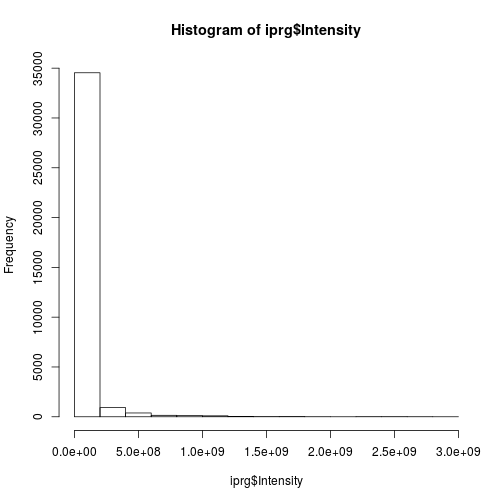

Our histogram looks quite skewed. How does this look on log-scale?

Do you recognise this distribution? The distribution for
log2-transformed intensities looks very similar to the normal
distribution. The advantage of working with normally distributed data
is that we can apply a variety of statistical tests to analyse and
interpret our data. Let's add a log2-scaled intensity column to our
data so we don't have to transform the original intensities every time
we need them.


```r
hist(iprg$Log2Intensity,
	 xlab = "log2 transformed intensities",
	 main = "Histogram of iPRG data")
```


In this case, we have duplicated information in our data, we have the
raw and log-transformed data. This is not necessary (and not advised),
as it is straightforward to transform the data on the flight.


```r
hist(log2(iprg$Intensity),
	 xlab = "log2 transformed intensities",
	 main = "Histogram of iPRG data")
```


We look at the summary for the log2-transformed values including the
value for the mean. Let's fix that first.


```r
summary(iprg$Log2Intensity)
```

```
##    Min. 1st Qu.  Median    Mean 3rd Qu.    Max. 
##   16.37   23.78   24.68   24.82   25.78   31.42
```


> **Challenge**
>
> Reproduce the histogram above but plotting the data on the log base
> 10 scale, using the `log10` function. See also the more general
> `log` function.


<details>

```r
hist(log10(iprg$Intensity))
```

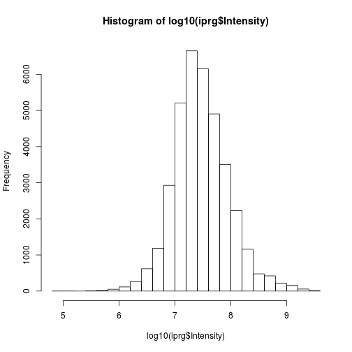
</details>

## Boxplot or box-and-whisker plot

Boxplots are extremely useful because they allow us to quickly
visualise the data distribution, without making assumptions of the
distribution type (non-parametric). We can read up on what statistics
the different elements of a box-and-whisker represent in the R help
files.


```r
boxplot(iprg$Log2Intensity)
```

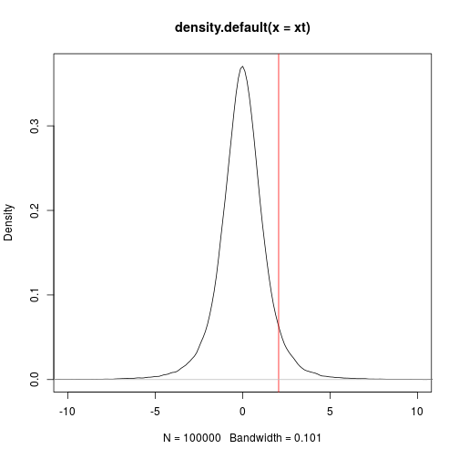

The boxplot, however, shows us the intensities for all conditions and
replicates. If we want to display the data for, we have multile
possibilities.

* We can first split the data, using the `by` function


```r
int_by_run <- by(iprg$Log2Intensity, iprg$Run, c)
boxplot(int_by_run)
```


* We can use the formula syntax


```r
boxplot(Log2Intensity ~ Run, data = iprg)
```

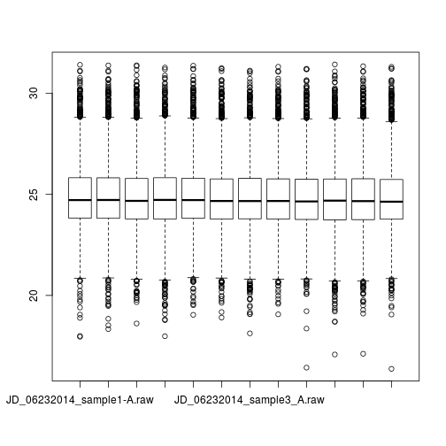

* We can use the `ggplot2` package that is very flexible to visualise
  data under different angles.


## The `ggplot2`  package

`ggplot2` is a plotting package that makes it simple to create
complex plots from data in a data frame. It provides a more
programmatic interface for specifying what variables to plot, how they
are displayed, and general visual properties, so we only need minimal
changes if the underlying data change or if we decide to change from a
bar plot to a scatterplot. This helps in creating publication quality
plots with minimal amounts of adjustments and tweaking.

### Comparison between base graphics and `ggplot2`

**Base graphics**

Uses a *canvas model* a series of instructions that sequentially fill
the plotting canvas. While this model is very useful to build plots
bits by bits bottom up, which is useful in some cases, it has some
clear drawback:

* Layout choices have to be made without global overview over what may
  still be coming.
* Different functions for different plot types with different
  interfaces.
* No standard data input.
* Many routine tasks require a lot of boilerplate code.
* No concept of facets/lattices/viewports.
* Poor default colours.

**The grammar of graphics**

The components of `ggplot2`'s of graphics are

1. A **tidy** dataset
2. A choice of geometric objects that servers as the visual
   representation of the data - for instance, points, lines,
   rectangles, contours.
3. A description of how the variables in the data are mapped to visual
   properties (aesthetics) or the geometric objects, and an associated
   scale (e.g. linear, logarithmic, polar)
4. A statistical summarisation rule
5. A coordinate system.
6. A facet specification, i.e. the use of several plots to look at the
   same data.


Fist of all, we need to load the `ggplot2` package


```r
library("ggplot2")
```

ggplot graphics are built step by step by adding new elements.

To build a ggplot we need to:

* bind the plot to a specific data frame using the `data` argument


```r
ggplot(data = iprg)
```

* define aesthetics (`aes`), by selecting the variables to be plotted
  and the variables to define the presentation such as plotting size,
  shape color, etc.


```r
ggplot(data = iprg, aes(x = Run, y = Log2Intensity))
```

* add `geoms` -- graphical representation of the data in the plot
	 (points, lines, bars). To add a geom to the plot use `+` operator


```r
ggplot(data = iprg, aes(x = Run, y = Log2Intensity)) +
  geom_boxplot()
```

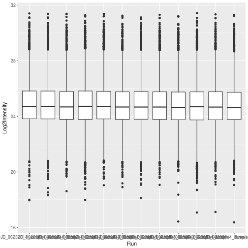

See the [documentation page](http://ggplot2.tidyverse.org/reference/)
to explore the many available `geoms`.


The `+` in the `ggplot2` package is particularly useful because it
allows you to modify existing `ggplot` objects. This means you can
easily set up plot "templates" and conveniently explore different
types of plots, so the above plot can also be generated with code like
this:


```r
## Assign plot to a variable
ints_plot <- ggplot(data = iprg, aes(x = Run, y = Log2Intensity))

## Draw the plot
ints_plot + geom_boxplot()
```

Notes:

* Anything you put in the `ggplot()` function can be seen by any geom layers
  that you add (i.e., these are universal plot settings). This includes the x and
  y axis you set up in `aes()`.

* You can also specify aesthetics for a given geom independently of the
  aesthetics defined globally in the `ggplot()` function.

* The `+` sign used to add layers must be placed at the end of each
  line containing a layer. If, instead, the `+` sign is added in the
  line before the other layer, `ggplot2` will not add the new layer
  and will return an error message.


> **Challenge**
>
> * Repeat the plot above but displaying the raw intensities.
> * Log-10 transform the raw intensities on the flight when plotting.

<details>

```r
ggplot(data = iprg, aes(x = Run, y = Intensity)) + geom_boxplot()
```


```r
ggplot(data = iprg, aes(x = Run, y = log10(Intensity))) + geom_boxplot()
```

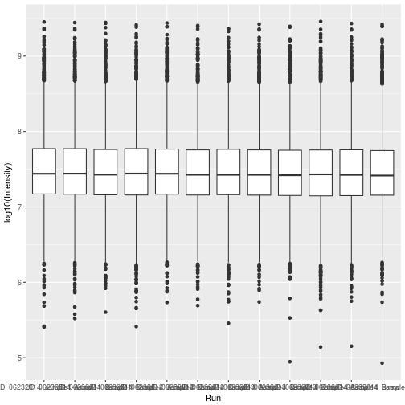
</details>


## Customising plots

First, let's colour the boxplot based on the condition:


```r
ggplot(data = iprg,
	   aes(x = Run, y = Log2Intensity,
		   fill = Condition)) +
  geom_boxplot()
```


Now let's rename all axis labels and title, and rotate the x-axis
labels 90 degrees. We can add those specifications using the `labs`
and `theme` functions of the `ggplot2` package.


```r
ggplot(aes(x = Run, y = Log2Intensity, fill = Condition),
	   data = iprg) +
	geom_boxplot() +
	labs(title = 'Log2 transformed intensity distribution per MS run',
		 y = 'Log2(Intensity)',
		 x = 'MS run') +
	theme(axis.text.x = element_text(angle = 90))
```

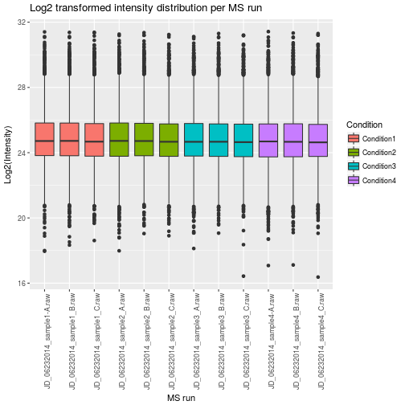


And easily switch from a boxplot to a violin plot representation by
changing the `geom` type.


```r
ggplot(aes(x = Run, y = Log2Intensity, fill = Condition),
	   data = iprg) +
	geom_violin() +
	labs(title = 'Log2 transformed intensity distribution per Subject',
		 y = 'Log2(Intensity)',
		 x = 'MS run') +
	theme(axis.text.x = element_text(angle = 90))
```

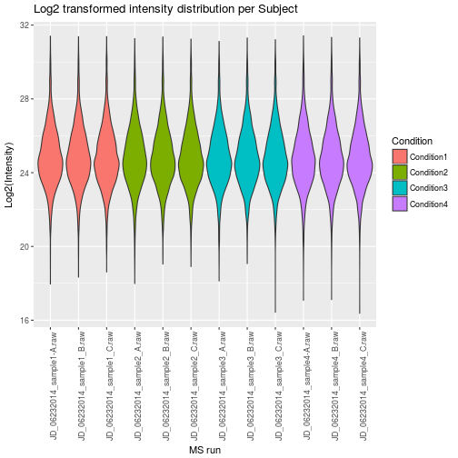

Finally, we can also overlay multiple geoms by simply *adding* them
one after the other.


```r
p <- ggplot(aes(x = Run, y = Log2Intensity, fill = Condition),
			data = iprg)
p + geom_boxplot()
```

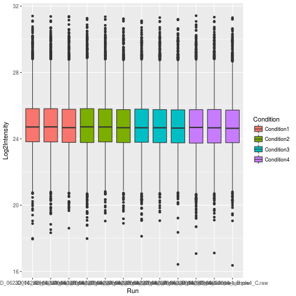

```r
p + geom_boxplot() + geom_jitter() ## not very usefull
```

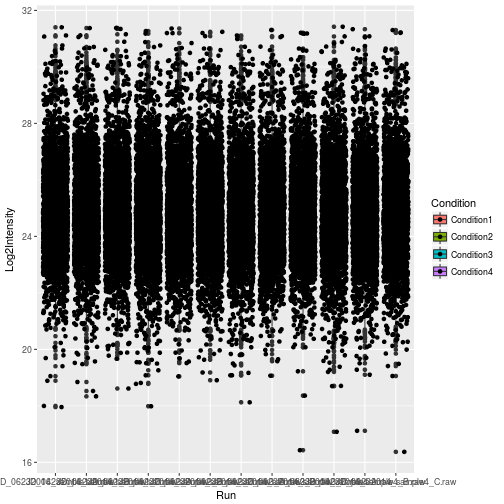

```r
p + geom_jitter() + geom_boxplot()
```

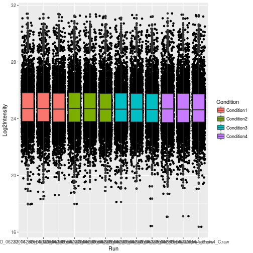

```r
p + geom_jitter(alpha = 0.1) + geom_boxplot()
```

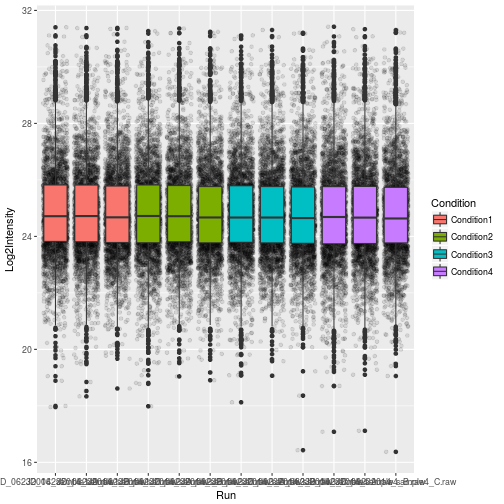

> **Challenge**
>
> * Overlay a boxplot goem on top of a jitter geom for the raw or
>   log-10 transformed intensities.
> * Customise the plot as suggested above.

<details>

```r
## Note how the log10 transformation is applied to both geoms
ggplot(data = iprg, aes(x = Run, y = log10(Intensity))) +
	geom_jitter(alpha = 0.1) +
	geom_boxplot()
```

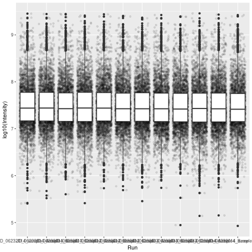
</details>

Finally, a very useful feature of `ggplot2` is **facetting**, that
defines how to subset the data into different *panels* (facets).


```r
names(iprg)
```

```
## [1] "Protein"       "Log2Intensity" "Run"           "Condition"    
## [5] "BioReplicate"  "Intensity"     "TechReplicate"
```

```r
ggplot(data = iprg,
	   aes(x = TechReplicate, y = Log2Intensity,
		   fill = Condition)) +
	geom_boxplot() +
	facet_grid(~ Condition)
```

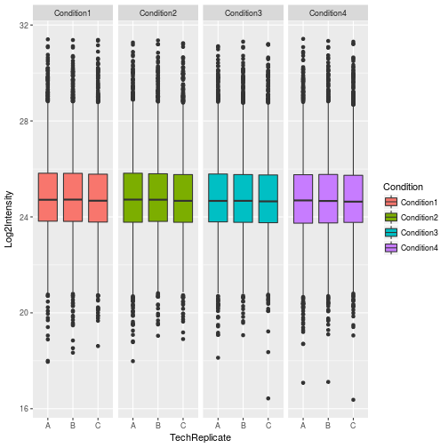

## Saving your figures

You can save plots to a number of different file formats. PDF is by
far the most common format because it's lightweight, cross-platform
and scales up well but jpegs, pngs and a number of other file formats
are also supported. Let's redo the last barplot but save it to the
file system this time.

Let's save the boxplot as pdf file.


```r
pdf()
p + geom_jitter(alpha = 0.1) + geom_boxplot()
dev.off()
```

The default file name is `Rplots.pdf`. We can customise that file name
specifying it by passing the file name, as a character, to the `pdf()`
function.

> **Challenge**
>
> Save a figure of your choice to a pdf file. Read the manual for the
> `png` function and save that same image to a png file.
>
> **Tip**: save your figures in a dedicated directory.

## Saving our results

The `iprg` data frame, that was read from the `csv` file. This
object can be easily regenerated using `read.csv`, and hence doesn't
necessarily to be saved explicity.


```r
save(iprg, file = "./data/iprg.rda")
```

---

Back to course [home page](http://bit.ly/2018MayInstRstats) - last update Thu May  3 12:00:39 2018
