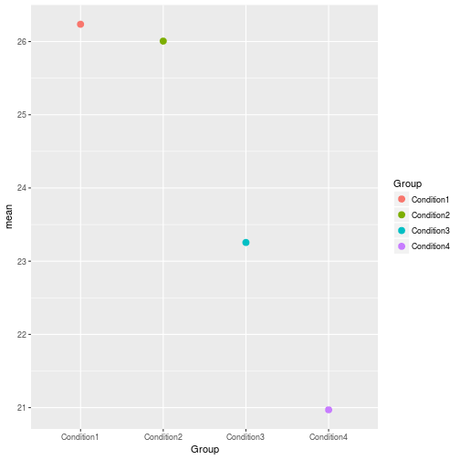
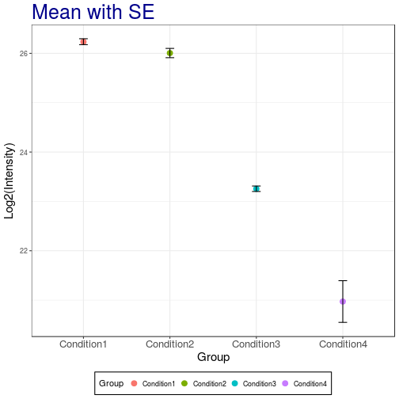
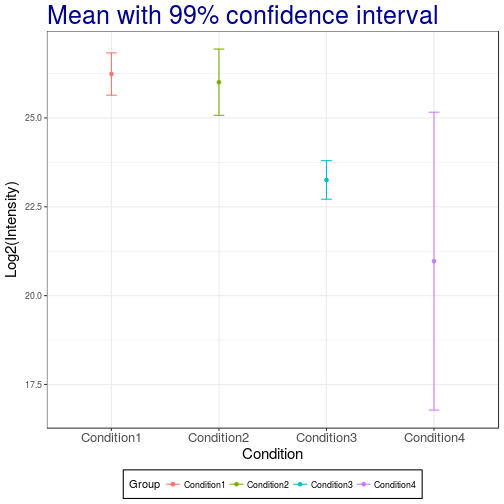
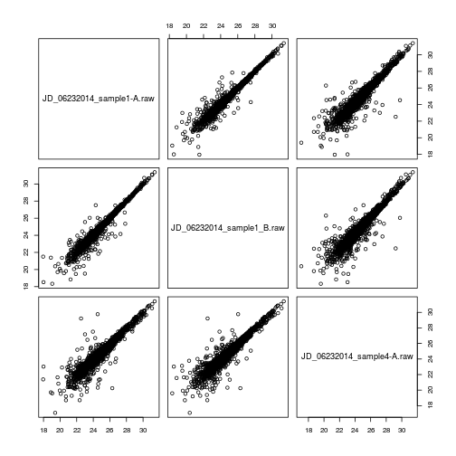
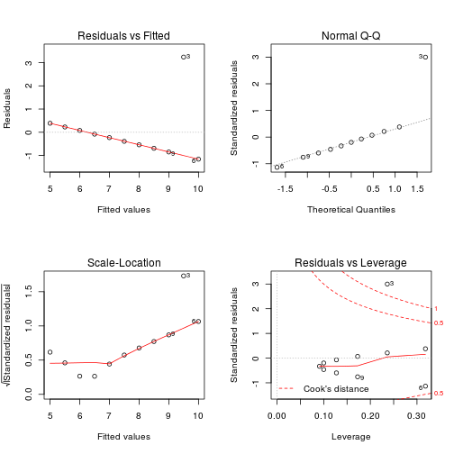
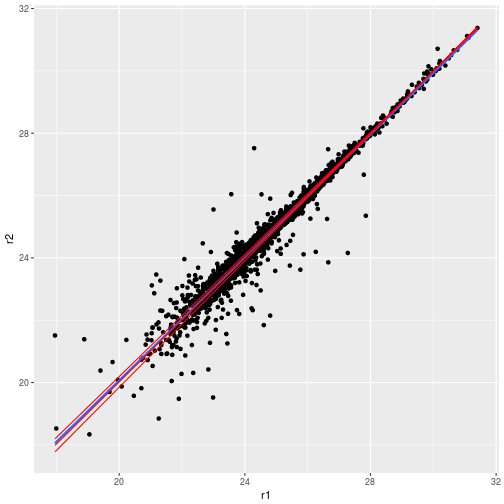
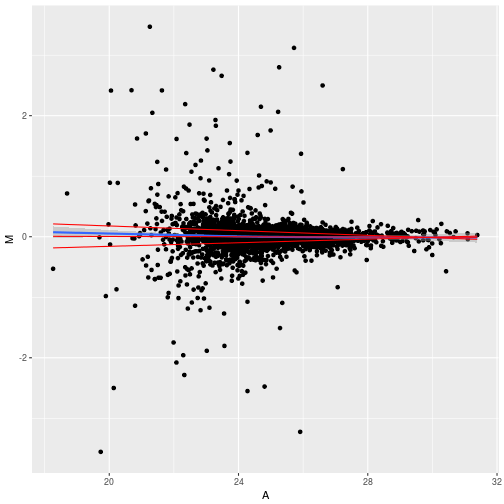

# Objectives

- Randomization and basic statistics
- Statistical hypothesis testing: t-test
- Sample size calculation
- Analysis for categorical data
- Linear regression and correlation

---

# Part 1: Basic statistics

## Randomization

### Random selection of samples from a larger set

Let's assume that we have the population with a total of 10 subjects. Suppose we label them from 1 to 10 and randomly would like
to select 3 subjects we can do this using the `sample` function. When
we run `sample` another time, different subjects will be selected. Try
this a couple times.


```r
sample(10, 3)
```

```
## [1] 5 4 3
```

```r
sample(10, 3)
```

```
## [1]  2  9 10
```

Now suppose we would like to select the same randomly selected samples
every time, then we can use a random seed number.


```r
set.seed(3728)
sample(10, 3)
```

```
## [1] 5 8 7
```

```r
set.seed(3728)
sample(10, 3)
```

```
## [1] 5 8 7
```

Let's practice with fun example. Select two in our group member for coming early next Monday.

```r
group.member <- c('Cyril', 'Dan', 'Kylie', 'Meena', 'Sara', 'Ting', 'Tsung-Heng', 'Tyler')
sample(group.member, 2)
```

```
## [1] "Sara" "Ting"
```


### Completely randomized order of MS runs

Let's load `iprg` data first.

```r
load('./data/iprg.rda')
```

We can also create a random order using all elements of iPRG
dataset. Again, we can achieve this using `sample`, asking for exactly
the amount of samples in the subset. This time, each repetition gives
us a different order of the complete set.


```r
msrun <- unique(iprg$Run)
msrun
```

```
##  [1] "JD_06232014_sample1_B.raw" "JD_06232014_sample1_C.raw"
##  [3] "JD_06232014_sample1-A.raw" "JD_06232014_sample2_A.raw"
##  [5] "JD_06232014_sample2_B.raw" "JD_06232014_sample2_C.raw"
##  [7] "JD_06232014_sample3_A.raw" "JD_06232014_sample3_B.raw"
##  [9] "JD_06232014_sample3_C.raw" "JD_06232014_sample4_B.raw"
## [11] "JD_06232014_sample4_C.raw" "JD_06232014_sample4-A.raw"
```

```r
## randomize order among all 12 MS runs
sample(msrun, length(msrun))
```

```
##  [1] "JD_06232014_sample1_B.raw" "JD_06232014_sample3_C.raw"
##  [3] "JD_06232014_sample4_B.raw" "JD_06232014_sample1_C.raw"
##  [5] "JD_06232014_sample3_B.raw" "JD_06232014_sample4_C.raw"
##  [7] "JD_06232014_sample3_A.raw" "JD_06232014_sample2_B.raw"
##  [9] "JD_06232014_sample1-A.raw" "JD_06232014_sample2_C.raw"
## [11] "JD_06232014_sample4-A.raw" "JD_06232014_sample2_A.raw"
```

```r
## different order will be shown.
sample(msrun, length(msrun))
```

```
##  [1] "JD_06232014_sample3_B.raw" "JD_06232014_sample2_A.raw"
##  [3] "JD_06232014_sample3_A.raw" "JD_06232014_sample2_B.raw"
##  [5] "JD_06232014_sample2_C.raw" "JD_06232014_sample3_C.raw"
##  [7] "JD_06232014_sample4-A.raw" "JD_06232014_sample1-A.raw"
##  [9] "JD_06232014_sample4_B.raw" "JD_06232014_sample1_C.raw"
## [11] "JD_06232014_sample1_B.raw" "JD_06232014_sample4_C.raw"
```

### Randomized block design

- Allow to remove known sources of variability that you are not
  interested in.

- Group conditions into blocks such that the conditions in a block are
  as similar as possible.

- Randomly assign samples with a block.

This particular dataset contains a total of 12 MS runs across 4
conditions, 3 technical replicates per condition. Using the
`block.random` function in the `psych` package, we can achieve
randomized block designs! `block.random` function makes random assignment of `n` subjects with an equal number in all of `N` conditions.


```r
library("psych") ## load the psych package

msrun <- unique(iprg[, c('Condition','Run')])
msrun
```

```
##     Condition                       Run
## 1  Condition1 JD_06232014_sample1_B.raw
## 2  Condition1 JD_06232014_sample1_C.raw
## 3  Condition1 JD_06232014_sample1-A.raw
## 4  Condition2 JD_06232014_sample2_A.raw
## 5  Condition2 JD_06232014_sample2_B.raw
## 6  Condition2 JD_06232014_sample2_C.raw
## 7  Condition3 JD_06232014_sample3_A.raw
## 8  Condition3 JD_06232014_sample3_B.raw
## 9  Condition3 JD_06232014_sample3_C.raw
## 10 Condition4 JD_06232014_sample4_B.raw
## 11 Condition4 JD_06232014_sample4_C.raw
## 12 Condition4 JD_06232014_sample4-A.raw
```

```r
## 4 Conditions of 12 MS runs randomly ordered
block.random(n = 12, c(Condition = 4))
```

```
##     blocks Condition
## S1       1         4
## S2       1         2
## S3       1         3
## S4       1         1
## S5       2         2
## S6       2         1
## S7       2         3
## S8       2         4
## S9       3         4
## S10      3         3
## S11      3         2
## S12      3         1
```

```r
block.random(n = 12, c(Condition = 4, BioReplicate=3))
```

```
##     blocks Condition BioReplicate
## S1       1         4            2
## S2       1         4            1
## S3       1         3            1
## S4       1         1            1
## S5       1         1            2
## S6       1         3            3
## S7       1         2            1
## S8       1         2            3
## S9       1         4            3
## S10      1         2            2
## S11      1         1            3
## S12      1         3            2
```


## Basic statistical summaries


```r
library(dplyr)
```

```
## 
## Attaching package: 'dplyr'
```

```
## The following objects are masked from 'package:stats':
## 
##     filter, lag
```

```
## The following objects are masked from 'package:base':
## 
##     intersect, setdiff, setequal, union
```
### Calculate simple statistics

Let's start data with one protein as an example and calculate the
mean, standard deviation, standard error of the mean across all
replicates per condition. We then store all the computed statistics
into a single summary data frame for easy access.

We can use the `aggregate` function to compute summary statistics. `aggregate` splits the data into subsets, computes summary statistics for each, and returns the result in a convenient form.


```r
# check what proteins are in dataset, show all protein names
head(unique(iprg$Protein))
```

```
## [1] "sp|D6VTK4|STE2_YEAST"  "sp|O13297|CET1_YEAST"  "sp|O13329|FOB1_YEAST" 
## [4] "sp|O13539|THP2_YEAST"  "sp|O13547|CCW14_YEAST" "sp|O13563|RPN13_YEAST"
```

```r
length(unique(iprg$Protein))
```

```
## [1] 3027
```

```r
#distinct(iprg, Protein)
n_distinct(iprg$Protein)
```

```
## [1] 3027
```


```r
# Let's start with one protein, named "sp|P44015|VAC2_YEAST"
oneproteindata <- iprg[iprg$Protein == "sp|P44015|VAC2_YEAST", ]

# there are 12 rows in oneproteindata
oneproteindata
```

```
## # A tibble: 12 x 7
##    Protein      Log2Intensity Run         Condition BioReplicate Intensity
##    <chr>                <dbl> <chr>       <chr>            <int>     <dbl>
##  1 sp|P44015|V…          26.3 JD_0623201… Conditio…            1 82714388.
##  2 sp|P44015|V…          26.1 JD_0623201… Conditio…            1 72749239.
##  3 sp|P44015|V…          26.3 JD_0623201… Conditio…            1 82100518.
##  4 sp|P44015|V…          25.8 JD_0623201… Conditio…            2 59219741.
##  5 sp|P44015|V…          26.1 JD_0623201… Conditio…            2 72690802.
##  6 sp|P44015|V…          26.1 JD_0623201… Conditio…            2 71180513.
##  7 sp|P44015|V…          23.1 JD_0623201… Conditio…            3  9295260.
##  8 sp|P44015|V…          23.3 JD_0623201… Conditio…            3 10505591.
##  9 sp|P44015|V…          23.3 JD_0623201… Conditio…            3 10295788.
## 10 sp|P44015|V…          20.9 JD_0623201… Conditio…            4  2019205.
## 11 sp|P44015|V…          21.7 JD_0623201… Conditio…            4  3440629.
## 12 sp|P44015|V…          20.3 JD_0623201… Conditio…            4  1248781.
## # ... with 1 more variable: TechReplicate <chr>
```

```r
# with dplyr
oneproteindata.bcp <- filter(iprg, Protein == "sp|P44015|VAC2_YEAST")
oneproteindata.bcp
```

```
## # A tibble: 12 x 7
##    Protein      Log2Intensity Run         Condition BioReplicate Intensity
##    <chr>                <dbl> <chr>       <chr>            <int>     <dbl>
##  1 sp|P44015|V…          26.3 JD_0623201… Conditio…            1 82714388.
##  2 sp|P44015|V…          26.1 JD_0623201… Conditio…            1 72749239.
##  3 sp|P44015|V…          26.3 JD_0623201… Conditio…            1 82100518.
##  4 sp|P44015|V…          25.8 JD_0623201… Conditio…            2 59219741.
##  5 sp|P44015|V…          26.1 JD_0623201… Conditio…            2 72690802.
##  6 sp|P44015|V…          26.1 JD_0623201… Conditio…            2 71180513.
##  7 sp|P44015|V…          23.1 JD_0623201… Conditio…            3  9295260.
##  8 sp|P44015|V…          23.3 JD_0623201… Conditio…            3 10505591.
##  9 sp|P44015|V…          23.3 JD_0623201… Conditio…            3 10295788.
## 10 sp|P44015|V…          20.9 JD_0623201… Conditio…            4  2019205.
## 11 sp|P44015|V…          21.7 JD_0623201… Conditio…            4  3440629.
## 12 sp|P44015|V…          20.3 JD_0623201… Conditio…            4  1248781.
## # ... with 1 more variable: TechReplicate <chr>
```


```r
# If you want to see more details,
?aggregate
```

### Calculate mean per groups


```r
## splits 'oneproteindata' into subsets by 'Condition',
## then, compute 'FUN=mean' of 'log2Int'
sub.mean <- aggregate(Log2Intensity ~ Condition,
					  data = oneproteindata,
					  FUN = mean)
sub.mean
```

```
##    Condition Log2Intensity
## 1 Condition1      26.23632
## 2 Condition2      26.00661
## 3 Condition3      23.25609
## 4 Condition4      20.97056
```

```r
# with dplyr
sub.mean.bcp <- oneproteindata %>%
	group_by(Condition) %>%
	summarise(mean=mean(Log2Intensity))

sub.mean.bcp
```

```
## # A tibble: 4 x 2
##   Condition   mean
##   <chr>      <dbl>
## 1 Condition1  26.2
## 2 Condition2  26.0
## 3 Condition3  23.3
## 4 Condition4  21.0
```

### Calculate SD (standard deviation) per groups

$$ s = \sqrt{\frac{1}{n-1} \sum_{i=1}^n (x_i - \bar x)^2} $$

> **Challenge**
>
> Using the `aggregate` function above, calculate the standard
> deviation, by applying the `median` function.

<details>

```r
## The same as mean calculation above. 'FUN' is changed to 'sd'.
sub.median <- aggregate(Log2Intensity ~ Condition,
					data = oneproteindata, FUN = median)
sub.median
```

```
##    Condition Log2Intensity
## 1 Condition1      26.29089
## 2 Condition2      26.08498
## 3 Condition3      23.29555
## 4 Condition4      20.94536
```

```r
# with dplyr
sub.median.bcp <- oneproteindata %>%
	group_by(Condition) %>%
	summarise(median=median(Log2Intensity))

sub.median.bcp
```

```
## # A tibble: 4 x 2
##   Condition  median
##   <chr>       <dbl>
## 1 Condition1   26.3
## 2 Condition2   26.1
## 3 Condition3   23.3
## 4 Condition4   20.9
```
</details>

> Using the `aggregate` function above, calculate the standard
> deviation, by applying the `sd` function.

<details>

```r
## The same as mean calculation above. 'FUN' is changed to 'sd'.
sub.sd <- aggregate(Log2Intensity ~ Condition,
					data = oneproteindata, FUN = sd)
sub.sd
```

```
##    Condition Log2Intensity
## 1 Condition1    0.10396539
## 2 Condition2    0.16268179
## 3 Condition3    0.09467798
## 4 Condition4    0.73140174
```

```r
# with dplyr
sub.sd.bcp <- oneproteindata %>%
	group_by(Condition) %>%
	summarise(sd = sd(Log2Intensity))

sub.sd.bcp
```

```
## # A tibble: 4 x 2
##   Condition      sd
##   <chr>       <dbl>
## 1 Condition1 0.104 
## 2 Condition2 0.163 
## 3 Condition3 0.0947
## 4 Condition4 0.731
```
</details>

### Count the number of observation per groups

> **Challenge**
>
> Using the `aggregate` function above, count the number of
> observations per group with the `length` function.

<details>

```r
## The same as mean calculation. 'FUN' is changed 'length'.
sub.len <- aggregate(Log2Intensity ~ Condition,
					 data = oneproteindata,
					 FUN = length)
sub.len
```

```
##    Condition Log2Intensity
## 1 Condition1             3
## 2 Condition2             3
## 3 Condition3             3
## 4 Condition4             3
```

```r
# with dplyr
sub.len.bcp <- oneproteindata %>%
	group_by(Condition) %>%
	summarise(count = n())

sub.len.bcp
```

```
## # A tibble: 4 x 2
##   Condition  count
##   <chr>      <int>
## 1 Condition1     3
## 2 Condition2     3
## 3 Condition3     3
## 4 Condition4     3
```
</details>

### Calculate SE (standard error of mean) per groups

$$ SE = \sqrt{\frac{s^2}{n}} $$


```r
sub.se <- sqrt(sub.sd$Log2Intensity^2 / sub.len$Log2Intensity)
sub.se
```

```
## [1] 0.06002444 0.09392438 0.05466236 0.42227499
```

We can now make the summary table including the results above (mean,
sd, se and length).


```r
## paste0 : concatenate vectors after convering to character.
(grp <- paste0("Condition", 1:4))
```

```
## [1] "Condition1" "Condition2" "Condition3" "Condition4"
```

```r
## It is equivalent to paste("Condition", 1:4, sep="")
summaryresult <- data.frame(Group = grp,
							mean = sub.mean$Log2Intensity,
							sd = sub.sd$Log2Intensity,
							se = sub.se,
							length = sub.len$Log2Intensity)
summaryresult
```

```
##        Group     mean         sd         se length
## 1 Condition1 26.23632 0.10396539 0.06002444      3
## 2 Condition2 26.00661 0.16268179 0.09392438      3
## 3 Condition3 23.25609 0.09467798 0.05466236      3
## 4 Condition4 20.97056 0.73140174 0.42227499      3
```

> **Challenge**
>
> Make the same table as summaryresult with dplyr package.

<details>

```r
summaryresult.dplyr <- oneproteindata %>%
	group_by(Condition) %>%
	summarise(mean = mean(Log2Intensity),
			  sd = sd(Log2Intensity),
			  length = n())
summaryresult.dplyr <- mutate(summaryresult.dplyr, se=sqrt(sd^2 / length))

summaryresult.dplyr
```

```
## # A tibble: 4 x 5
##   Condition   mean     sd length     se
##   <chr>      <dbl>  <dbl>  <int>  <dbl>
## 1 Condition1  26.2 0.104       3 0.0600
## 2 Condition2  26.0 0.163       3 0.0939
## 3 Condition3  23.3 0.0947      3 0.0547
## 4 Condition4  21.0 0.731       3 0.422
```
</details>

## Visualization with error bars for descriptive purpose

*error bars* can have a variety of meanings or conclusions if what
they represent is not precisely specified. Below we provide some
examples of which types of error bars are common. We're using the
summary of protein `sp|P44015|VAC2_YEAST` from the previous section
and the `ggplot2` package as it provides a convenient way to make
easily adaptable plots.


```r
library(ggplot2)
```

```
## 
## Attaching package: 'ggplot2'
```

```
## The following objects are masked from 'package:psych':
## 
##     %+%, alpha
```


```r
# means without any errorbar
p <- ggplot(aes(x = Group, y = mean, colour = Group),
			data = summaryresult)+
	geom_point(size = 3)
p
```



Let's change a number of visual properties to make the plot more attractive.

* Let's change the labels of x-axis and y-axis and title: `labs(title="Mean", x="Condition", y='Log2(Intensity)')`
* Let's change background color for white: `theme_bw()`
* Let's change size or color of labels of axes and title, text of
  x-axis by using a *theme*
* Let's change the position of legend (use `'none'` to remove it)
* Let's make the box for legend
* Let's remove the box for legend key.

See also this
[post](http://ggplot2.tidyverse.org/reference/theme.html) for options of *theme*,
[post](http://ggplot2.tidyverse.org/reference/ggtheme.html) for complete theme.


```r
p2 <- p + labs(title = "Mean", x = "Group", y = 'Log2(Intensity)') +
	theme_bw() +
	theme(plot.title = element_text(size = 25, colour = "darkblue"),
		  axis.title.x = element_text(size = 15),
		  axis.title.y = element_text(size = 15),
		  axis.text.x = element_text(size = 13),
		  legend.position = 'bottom',
		  legend.background = element_rect(colour = 'black'),
		  legend.key = element_rect(colour = 'white'))
p2
```


Let's now add the **standard deviation**:


```r
# mean with SD
p2 + geom_errorbar(aes(ymax = mean + sd, ymin = mean - sd), width = 0.1) +
	  labs(title="Mean with SD")
```


> **Challenge**
>
> Add the **standard error of the mean**. Which one is smaller?

<details>

```r
# mean with SE
p2 + geom_errorbar(aes(ymax = mean + se, ymin=mean - se), width = 0.1) +
	labs(title="Mean with SE")
```


```r
## The SE is narrow than the SD!
```
</details>

> **Challenge**
>
> Add the **standard error of the mean** with black color.

<details>

```r
# mean with SE
p2 + geom_errorbar(aes(ymax = mean + se, ymin=mean - se), width = 0.1, color='black') +
	labs(title="Mean with SE")
```


</details>

## Working with statistical distributions

For each statistical distribution, we have function to compute

* density
* distribution function
* quantile function
* random generation

For the normale distribution `norm`, these are respectively

* `dnorm`
* `pnorm`
* `qnorm`
* `rnorm`

Let's start by sampling 1000000 values from a normal distribution $N(0, 1)$:


```r
xn <- rnorm(1e6)
hist(xn, freq = FALSE)
rug(xn)
lines(density(xn), lwd = 2)
```


By definition, the area under the density curve is 1. The area at the
left of 0, 1, and 2 are respectively:


```r
pnorm(0)
```

```
## [1] 0.5
```

```r
pnorm(1)
```

```
## [1] 0.8413447
```

```r
pnorm(2)
```

```
## [1] 0.9772499
```

To ask the inverse question, we use the quantile function. The obtain
0.5, 0.8413447 and 0.9772499 of our distribution, we need means
of:


```r
qnorm(0.5)
```

```
## [1] 0
```

```r
qnorm(pnorm(1))
```

```
## [1] 1
```

```r
qnorm(pnorm(2))
```

```
## [1] 2
```

```r
qnorm(0.05)
```

```
## [1] -1.644854
```

Finally, the density function gives us the *height* at which we are
for a given mean:


```r
hist(xn, freq = FALSE)
lines(density(xn), lwd = 2)
points(0, dnorm(0), pch = 19, col = "red")
points(1, dnorm(1), pch = 1, col = "blue")
points(2, dnorm(2), pch = 4, col = "orange")
```


## Calculate the confidence interval

Now that we've covered the standard error of the mean and the standard
deviation, let's investigate how we can add custom confidence
intervals (CI) for our measurement of the mean. We'll add these CI's
to the summary results we previously stored for protein
`sp|P44015|VAC2_YEAST`.

Confidence interval:

$$\mbox{mean} \pm (SE \times \frac{\alpha}{2} ~ \mbox{quantile of t distribution})$$


To calculate the 95% confident interval, we need to be careful and set
the quantile for two-sided. We need to divide by two for error.  For
example, 95% confidence interval, right tail is 2.5% and left tail is
2.5%.


```r
summaryresult$ciw.lower.95 <- summaryresult$mean -
	qt(0.975, summaryresult$len - 1) * summaryresult$se
summaryresult$ciw.upper.95 <- summaryresult$mean +
	qt(0.975, summaryresult$len - 1) * summaryresult$se
summaryresult
```

```
##        Group     mean         sd         se length ciw.lower.95
## 1 Condition1 26.23632 0.10396539 0.06002444      3     25.97805
## 2 Condition2 26.00661 0.16268179 0.09392438      3     25.60248
## 3 Condition3 23.25609 0.09467798 0.05466236      3     23.02090
## 4 Condition4 20.97056 0.73140174 0.42227499      3     19.15366
##   ciw.upper.95
## 1     26.49458
## 2     26.41073
## 3     23.49128
## 4     22.78746
```
<details>

```r
summaryresult.dplyr %>% mutate(ciw.lower.95 = mean - qt(0.975, length-1)*se,
							   ciw.upper.95 = mean + qt(0.975, length-1)*se)
```

```
## # A tibble: 4 x 7
##   Condition   mean     sd length     se ciw.lower.95 ciw.upper.95
##   <chr>      <dbl>  <dbl>  <int>  <dbl>        <dbl>        <dbl>
## 1 Condition1  26.2 0.104       3 0.0600         26.0         26.5
## 2 Condition2  26.0 0.163       3 0.0939         25.6         26.4
## 3 Condition3  23.3 0.0947      3 0.0547         23.0         23.5
## 4 Condition4  21.0 0.731       3 0.422          19.2         22.8
```

```r
summaryresult.dplyr
```

```
## # A tibble: 4 x 5
##   Condition   mean     sd length     se
##   <chr>      <dbl>  <dbl>  <int>  <dbl>
## 1 Condition1  26.2 0.104       3 0.0600
## 2 Condition2  26.0 0.163       3 0.0939
## 3 Condition3  23.3 0.0947      3 0.0547
## 4 Condition4  21.0 0.731       3 0.422
```
</details>


```r
# mean with 95% two-sided confidence interval
ggplot(aes(x = Group, y = mean, colour = Group),
	   data = summaryresult) +
	geom_point() +
	geom_errorbar(aes(ymax = ciw.upper.95, ymin = ciw.lower.95), width = 0.1) +
	labs(title="Mean with 95% confidence interval", x="Condition", y='Log2(Intensity)') +
	theme_bw() +
	theme(plot.title = element_text(size=25, colour="darkblue"),
		  axis.title.x = element_text(size=15),
		  axis.title.y = element_text(size=15),
		  axis.text.x = element_text(size=13),
		  legend.position = 'bottom',
		  legend.background = element_rect(colour = 'black'),
		  legend.key = element_rect(colour='white'))
```


> **Challenges**
>
> Replicate the above for the 99% two-sided confidence interval.

<details>

```r
# mean with 99% two-sided confidence interval
summaryresult$ciw.lower.99 <- summaryresult$mean - qt(0.995,summaryresult$len-1) * summaryresult$se
summaryresult$ciw.upper.99 <- summaryresult$mean + qt(0.995,summaryresult$len-1) * summaryresult$se
summaryresult
```

```
##        Group     mean         sd         se length ciw.lower.95
## 1 Condition1 26.23632 0.10396539 0.06002444      3     25.97805
## 2 Condition2 26.00661 0.16268179 0.09392438      3     25.60248
## 3 Condition3 23.25609 0.09467798 0.05466236      3     23.02090
## 4 Condition4 20.97056 0.73140174 0.42227499      3     19.15366
##   ciw.upper.95 ciw.lower.99 ciw.upper.99
## 1     26.49458     25.64058     26.83205
## 2     26.41073     25.07442     26.93879
## 3     23.49128     22.71357     23.79860
## 4     22.78746     16.77955     25.16157
```

```r
ggplot(aes(x = Group, y = mean, colour = Group),
	   data = summaryresult) +
	geom_point() +
	geom_errorbar(aes(ymax = ciw.upper.99, ymin=ciw.lower.99), width=0.1) +
	labs(title="Mean with 99% confidence interval", x="Condition", y='Log2(Intensity)') +
	theme_bw()+
	theme(plot.title = element_text(size=25, colour="darkblue"),
		  axis.title.x = element_text(size=15),
		  axis.title.y = element_text(size=15),
		  axis.text.x = element_text(size=13),
		  legend.position = 'bottom',
		  legend.background = element_rect(colour='black'),
		  legend.key = element_rect(colour='white'))
```


</details>

### Some comments

* Error bars with SD and CI are overlapping between groups!

* Error bars for the SD show the spread of the population while error
  bars based on SE reflect the uncertainty in the mean and depend on
  the sample size.

* Confidence intervals of `n` on the other hand mean that the
  intervals capture the population mean `n` percent of the time.

* When the sample size increases, CI and SE are getting closer to each
  other.

## Saving our results

We have two objects that contain all the information that we have
generated so far:

* The `summaryresults` and `summaryresults.dplyr` objects, that contains all the summary
  statistics.


```r
save(summaryresult, file = "./data/summaryresults.rda")
save(summaryresult.dplyr, file = "./data/summaryresults.dplyr.rda")
```

We can also save the summary result as a `csv` file using the
`write.csv` function:


```r
write.csv(sumamryresult, file = "./data/summary.csv")
```

**Tip**: Exporting to csv is useful to share your work with
collaborators that do not use R, but for many continous work in R, to
assure data validity accords platforms, the best format is `rda`.

***
# Part 2: Statistical hypothesis test

First, we are going to prepare the session for further analyses.


```r
load("./data/summaryresults.rda")
load("./data/iprg.rda")
```

## Two sample t-test for one protein with one feature

Now, we'll perform a t-test whether protein `sp|P44015|VAC2_YEAST` has
a change in abundance between Condition 1 and Condition 2.

### Hypothesis

* $H_0$: no change in abundance, mean(Condition1) - mean(Condition2) = 0
* $H_a$: change in abundance, mean(Condition1) - mean(Condition 2) $\neq$ 0

### Statistics

* Observed $t = \frac{\mbox{difference of group means}}{\mbox{estimate of variation}} = \frac{(mean_{1} - mean_{2})}{SE} \sim t_{\alpha/2, df}$
* Standard error, $SE=\sqrt{\frac{s_{1}^2}{n_{1}} + \frac{s_{2}^2}{n_{2}}}$

with

* $n_{i}$: number of replicates
* $s_{i}^2 = \frac{1}{n_{i}-1} \sum (Y_{ij} - \bar{Y_{i \cdot}})^2$: sample variance

### Data preparation


```r
## Let's start with one protein, named "sp|P44015|VAC2_YEAST"
oneproteindata <- iprg[iprg$Protein == "sp|P44015|VAC2_YEAST", ]

## Then, get two conditions only, because t.test only works for two groups (conditions).
oneproteindata.condition12 <- oneproteindata[oneproteindata$Condition %in%
											 c('Condition1', 'Condition2'), ]
oneproteindata.condition12
```

```
## # A tibble: 6 x 7
##   Protein      Log2Intensity Run          Condition BioReplicate Intensity
##   <chr>                <dbl> <chr>        <chr>            <int>     <dbl>
## 1 sp|P44015|V…          26.3 JD_06232014… Conditio…            1 82714388.
## 2 sp|P44015|V…          26.1 JD_06232014… Conditio…            1 72749239.
## 3 sp|P44015|V…          26.3 JD_06232014… Conditio…            1 82100518.
## 4 sp|P44015|V…          25.8 JD_06232014… Conditio…            2 59219741.
## 5 sp|P44015|V…          26.1 JD_06232014… Conditio…            2 72690802.
## 6 sp|P44015|V…          26.1 JD_06232014… Conditio…            2 71180513.
## # ... with 1 more variable: TechReplicate <chr>
```

```r
table(oneproteindata.condition12[, c("Condition", "BioReplicate")])
```

```
##             BioReplicate
## Condition    1 2
##   Condition1 3 0
##   Condition2 0 3
```

<details>

```r
## with dplyr
## Let's start with one protein, named "sp|P44015|VAC2_YEAST"
oneproteindata <- filter(iprg, Protein == "sp|P44015|VAC2_YEAST")

## Then, get two conditions only, because t.test only works for two groups (conditions).
oneproteindata.subset <- filter(oneproteindata,
								Condition %in% c('Condition1', 'Condition2'))
oneproteindata.subset
```

```
## # A tibble: 6 x 7
##   Protein      Log2Intensity Run          Condition BioReplicate Intensity
##   <chr>                <dbl> <chr>        <chr>            <int>     <dbl>
## 1 sp|P44015|V…          26.3 JD_06232014… Conditio…            1 82714388.
## 2 sp|P44015|V…          26.1 JD_06232014… Conditio…            1 72749239.
## 3 sp|P44015|V…          26.3 JD_06232014… Conditio…            1 82100518.
## 4 sp|P44015|V…          25.8 JD_06232014… Conditio…            2 59219741.
## 5 sp|P44015|V…          26.1 JD_06232014… Conditio…            2 72690802.
## 6 sp|P44015|V…          26.1 JD_06232014… Conditio…            2 71180513.
## # ... with 1 more variable: TechReplicate <chr>
```

```r
table(oneproteindata.subset[, c("Condition", "BioReplicate")])
```

```
##             BioReplicate
## Condition    1 2
##   Condition1 3 0
##   Condition2 0 3
```
</details>

If we want to remove the levels that are not relevant anymore, we can
use `droplevels`:


```r
oneproteindata.subset <- droplevels(oneproteindata.subset)
table(oneproteindata.subset[, c("Condition", "BioReplicate")])
```

```
##             BioReplicate
## Condition    1 2
##   Condition1 3 0
##   Condition2 0 3
```

To perform the t-test, we use the `t.test` function. Let's first
familiarise ourselves with it by looking that the manual


```r
?t.test
```

And now apply to to our data


```r
# t test for different abundance (log2Int) between Groups (Condition)
result <- t.test(Log2Intensity ~ Condition,
				 data = oneproteindata.subset,
				 var.equal = FALSE)

result
```

```
## 
## 	Welch Two Sample t-test
## 
## data:  Log2Intensity by Condition
## t = 2.0608, df = 3.4001, p-value = 0.1206
## alternative hypothesis: true difference in means is not equal to 0
## 95 percent confidence interval:
##  -0.1025408  0.5619598
## sample estimates:
## mean in group Condition1 mean in group Condition2 
##                 26.23632                 26.00661
```

> **Challenge**
>
> Repeat the t-test above but with calculating a 90% confidence interval
> for the log2 fold change.

<details>

</details>

### The `htest` class

The `t.test` function, like other hypothesis testing function, return
a result of a type we haven't encountered yet, the `htest` class:


```r
class(result)
```

```
## [1] "htest"
```

which stores typical results from such tests. Let's have a more
detailed look at what information we can learn from the results our
t-test. When we type the name of our `result` object, we get a short
textual summary, but the object contains more details:


```r
names(result)
```

```
## [1] "statistic"   "parameter"   "p.value"     "conf.int"    "estimate"   
## [6] "null.value"  "alternative" "method"      "data.name"
```

and we can access each of these by using the `$` operator, like we
used to access a single column from a `data.frame`, but the `htest`
class is not a `data.frame` (it's actually a `list`). For example, to
access the group means, we would use


```r
result$estimate
```

```
## mean in group Condition1 mean in group Condition2 
##                 26.23632                 26.00661
```

> **Challenge**
>
> * Calculate the (log2-transformed) fold change between groups
> * Extract the value of the t-statistics
> * Calculate the standard error (fold-change/t-statistics)
> * Extract the degrees of freedom (parameter)
> * Extract the p values
> * Extract the 95% confidence intervals

<details>

</details>

We can also manually compute our t-test statistic using the formulas
we descibed above and compare it with the `summaryresult`.

Recall the `summaryresult` we generated last section.


```r
summaryresult
```

```
##        Group     mean         sd         se length ciw.lower.95
## 1 Condition1 26.23632 0.10396539 0.06002444      3     25.97805
## 2 Condition2 26.00661 0.16268179 0.09392438      3     25.60248
## 3 Condition3 23.25609 0.09467798 0.05466236      3     23.02090
## 4 Condition4 20.97056 0.73140174 0.42227499      3     19.15366
##   ciw.upper.95 ciw.lower.99 ciw.upper.99
## 1     26.49458     25.64058     26.83205
## 2     26.41073     25.07442     26.93879
## 3     23.49128     22.71357     23.79860
## 4     22.78746     16.77955     25.16157
```

```r
summaryresult12 <- summaryresult[1:2, ]

## test statistic, It is the same as 'result$statistic' above.
diff(summaryresult12$mean) ## different sign, but absolute values are same as result$estimate[1]-result$estimate[2]
```

```
## [1] -0.2297095
```

```r
sqrt(sum(summaryresult12$sd^2/summaryresult12$length)) ## same as stand error
```

```
## [1] 0.1114662
```

```r
## the t-statistic : sign is different
diff(summaryresult12$mean)/sqrt(sum(summaryresult12$sd^2/summaryresult12$length))
```

```
## [1] -2.060799
```

## Re-calculating the p values

Referring back to our t-test results above, we can manually calculate
the one- and two-side tests p-values using the t-statistics and the
test parameter (using the `pt` function).


Our result t statistic was 2.0607988 (accessible
with `result$statistic`). Let's start by visualising it along a t
distribution. Let's create data from such a distribution, making sure
we set to appropriate parameter.


```r
## generate 10^5 number with the same degree of freedom for distribution.
xt <- rt(1e5, result$parameter)
plot(density(xt), xlim = c(-10, 10))
abline(v = result$statistic, col = "red") ## where t statistics are located.
abline(h = 0, col = "gray") ## horizontal line at 0
```


**The area on the left** of that point is given by `pt(result$statistic,
result$parameter)`, which is 0.939693. The p-value for a one-sided test, which is ** the area on the right** of red line, is this given by


```r
1 - pt(result$statistic, result$parameter)
```

```
##          t 
## 0.06030697
```

And the p-value for a two-sided test is


```r
2 * (1 - pt(result$statistic, result$parameter))
```

```
##         t 
## 0.1206139
```

which is the same as the one calculated by the t-test.


***
# Part 3 : Choosing a model

The decision of which statistical model is appropriate for a given set of observations depends on the type of data that have been collected.

* Quantitative response with quantitative predictors : regression model

* Categorical response with quantitative predictors : logistic regression model for bivariate categorical response (e.g., Yes/No, dead/alive), multivariate logistic regression model when the response variable has more than two possible values.

* Quantitative response with categorical predictors : ANOVA model (quantitative response across several populations defined by one or more categorical predictor variables)

* Categorical response with categorical predictors : contingency table that can be used to draw conclusions about the relationships between variables.


Part 5b are adapted from *Bremer & Doerge*,
[Using R at the Bench : Step-by-Step Data Analytics for Biologists](https://www.amazon.com/dp/1621821129/ref=olp_product_details?_encoding=UTF8&me=)
, cold Spring Harbor LaboratoryPress, 2015.


***


# Part 4: Sample size calculation

To calculate the required sample size, you’ll need to know four
things:

* $\alpha$: confidence level
* $power$: 1 - $\beta$, where $\beta$ is probability of a true positive discovery
* $\Delta$: anticipated fold change
* $\sigma$: anticipated variance

## R code

Assuming equal varaince and number of samples across groups, the
following formula is used for sample size estimation:

$$\frac{2{\sigma}^2}{n}\leq(\frac{\Delta}{z_{1-\beta}+z_{1-\alpha/2}})^2$$


```r
library("pwr")

## ?pwr.t.test

# Significance level alpha
alpha <- 0.05

# Power = 1 - beta
power <- 0.95

# anticipated log2 fold change
delta <- 1

# anticipated variability
sigma <- 0.9

# Effect size
# It quantifies the size of the difference between two groups
d <- delta/sigma

#Sample size estimation
pwr.t.test(d = d, sig.level = alpha, power = power, type = 'two.sample')
```

```
## 
##      Two-sample t test power calculation 
## 
##               n = 22.06036
##               d = 1.111111
##       sig.level = 0.05
##           power = 0.95
##     alternative = two.sided
## 
## NOTE: n is number in *each* group
```


> **Challenge**
>
> * Calculate power with 10 samples and the same parameters as above.

<details>

</details>

Let's investigate the effect of required fold change and variance on the sample size estimation.


```r
# anticipated log2 fold change
delta <- seq(0.1, 0.7, .1)
nd <- length(delta)

# anticipated variability
sigma <- seq(0.1,0.5,.1)
ns <- length(sigma)

# obtain sample sizes
samsize <- matrix(0, nrow=ns*nd, ncol = 3)
counter <- 0
for (i in 1:nd){
  for (j in 1:ns){
	result <- pwr.t.test(d = delta[i] / sigma[j],
						 sig.level = alpha,
						 power = power,
						 type = "two.sample")
	counter <- counter + 1
	samsize[counter, 1] <- delta[i]
	samsize[counter, 2] <- sigma[j]
	samsize[counter, 3] <- ceiling(result$n)
  }
}
colnames(samsize) <- c("desiredlog2FC", "variability", "samplesize")

## visualization
samsize <- as.data.frame(samsize)
samsize$variability <- as.factor(samsize$variability)
ggplot(data=samsize, aes(x=desiredlog2FC, y=samplesize, group = variability, colour = variability)) +
  geom_line() +
  geom_point(size=2, shape=21, fill="white") +
  labs(title="Significance level=0.05, Power=0.95", x="Anticipated log2 fold change", y='Sample Size (n)') +
  theme(plot.title = element_text(size=20, colour="darkblue"),
		axis.title.x = element_text(size=15),
		axis.title.y = element_text(size=15),
		axis.text.x = element_text(size=13))
```


***

# Part 5: Linear models and correlation

When considering correlations and modelling data, visualization is key.

Let's use the famous
[*Anscombe's quartet*](https://en.wikipedia.org/wiki/Anscombe%27s_quartet)
data as a motivating example. This data is composed of 4 pairs of
values, $(x_1, y_1)$ to $(x_4, y_4)$:


| x1| x2| x3| x4|    y1|   y2|    y3|    y4|
|--:|--:|--:|--:|-----:|----:|-----:|-----:|
| 10| 10| 10|  8|  8.04| 9.14|  7.46|  6.58|
|  8|  8|  8|  8|  6.95| 8.14|  6.77|  5.76|
| 13| 13| 13|  8|  7.58| 8.74| 12.74|  7.71|
|  9|  9|  9|  8|  8.81| 8.77|  7.11|  8.84|
| 11| 11| 11|  8|  8.33| 9.26|  7.81|  8.47|
| 14| 14| 14|  8|  9.96| 8.10|  8.84|  7.04|
|  6|  6|  6|  8|  7.24| 6.13|  6.08|  5.25|
|  4|  4|  4| 19|  4.26| 3.10|  5.39| 12.50|
| 12| 12| 12|  8| 10.84| 9.13|  8.15|  5.56|
|  7|  7|  7|  8|  4.82| 7.26|  6.42|  7.91|
|  5|  5|  5|  8|  5.68| 4.74|  5.73|  6.89|

Each of these $x$ and $y$ sets have the same variance, mean and
correlation:


|         |          1|          2|          3|          4|
|:--------|----------:|----------:|----------:|----------:|
|var(x)   | 11.0000000| 11.0000000| 11.0000000| 11.0000000|
|mean(x)  |  9.0000000|  9.0000000|  9.0000000|  9.0000000|
|var(y)   |  4.1272691|  4.1276291|  4.1226200|  4.1232491|
|mean(y)  |  7.5009091|  7.5009091|  7.5000000|  7.5009091|
|cor(x,y) |  0.8164205|  0.8162365|  0.8162867|  0.8165214|

But...

While the *residuals* of the linear regression clearly indicate
fundamental differences in these data, the most simple and
straightforward approach is *visualisation* to highlight the
fundamental differences in the datasets.


See also another, more recent example:
[The Datasaurus Dozen dataset](https://www.autodeskresearch.com/publications/samestats).
<details>


</details>


## Correlation

Here is an example where a wide format comes very handy. We are going
to convert our iPRG data using the `spread` function from the `tidyr`
package:


```r
library("tidyr")
iprg2 <- spread(iprg[, 1:3], Run, Log2Intensity)
rownames(iprg2) <- iprg2$Protein
```

```
## Warning: Setting row names on a tibble is deprecated.
```

```r
iprg2 <- iprg2[, -1]
```


And lets focus on the 3 runs, i.e. 2 replicates from condition
1 and 1 replicate from condition 4.


```r
x <- iprg2[, c(1, 2, 10)]
head(x)
```

```
## # A tibble: 6 x 3
##   `JD_06232014_sample1-A.raw` JD_06232014_sample1_B.raw `JD_06232014_samp…
##                         <dbl>                     <dbl>              <dbl>
## 1                        26.6                      26.8               26.7
## 2                        24.7                      24.7               24.5
## 3                        23.5                      23.4               23.0
## 4                        24.3                      27.5               25.1
## 5                        27.1                      27.2               27.1
## 6                        26.2                      26.1               25.8
```

```r
pairs(x)
```



We can use the `cor` function to calculate the Pearson correlation
between two vectors of the same length (making sure the order is
correct), or a dataframe. But, we have missing values in the data,
which will stop us from calculating the correlation:


```r
cor(x)
```

```
##                           JD_06232014_sample1-A.raw
## JD_06232014_sample1-A.raw                         1
## JD_06232014_sample1_B.raw                        NA
## JD_06232014_sample4-A.raw                        NA
##                           JD_06232014_sample1_B.raw
## JD_06232014_sample1-A.raw                        NA
## JD_06232014_sample1_B.raw                         1
## JD_06232014_sample4-A.raw                        NA
##                           JD_06232014_sample4-A.raw
## JD_06232014_sample1-A.raw                        NA
## JD_06232014_sample1_B.raw                        NA
## JD_06232014_sample4-A.raw                         1
```

We first need to omit the proteins/rows that contain missing values


```r
x2 <- na.omit(x)
cor(x2)
```

```
##                           JD_06232014_sample1-A.raw
## JD_06232014_sample1-A.raw                 1.0000000
## JD_06232014_sample1_B.raw                 0.9794954
## JD_06232014_sample4-A.raw                 0.9502142
##                           JD_06232014_sample1_B.raw
## JD_06232014_sample1-A.raw                 0.9794954
## JD_06232014_sample1_B.raw                 1.0000000
## JD_06232014_sample4-A.raw                 0.9502517
##                           JD_06232014_sample4-A.raw
## JD_06232014_sample1-A.raw                 0.9502142
## JD_06232014_sample1_B.raw                 0.9502517
## JD_06232014_sample4-A.raw                 1.0000000
```

### A note on correlation and replication

It is often assumed that high correlation is a halmark of good
replication. Rather than focus on the correlation of the data, a
better measurement would be to look a the log2 fold-changes, i.e. the
distance between or repeated measurements. The ideal way to visualise
this is on an MA-plot:


```r
par(mfrow = c(1, 2))
r1 <- x2[, 1]
r2 <- x2[, 2]
M <- r1 - r2
A <- (r1 + r2)/2
plot(A, M); grid()
```

```
## Error in stripchart.default(x1, ...): invalid plotting method
```

```
## Error in int_abline(a = a, b = b, h = h, v = v, untf = untf, ...): plot.new has not been called yet
```

```r
suppressPackageStartupMessages(library("affy"))
affy::ma.plot(A, M)
```

```
## Error in quantile(as.numeric(x), c(0.25, 0.75), na.rm = na.rm, names = FALSE, : (list) object cannot be coerced to type 'double'
```

See also this
[post](http://simplystatistics.org/2015/08/12/correlation-is-not-a-measure-of-reproducibility/)
on the *Simply Statistics* blog.

## Linear modelling

`abline(0, 1)` can be used to add a line with intercept 0 and
slop 1. It we want to add the line that models the data linearly, we
can calculate the parameters using the `lm` function:


```r
lmod <- lm(r2 ~ r1)
```

```
## Error in model.frame.default(formula = r2 ~ r1, drop.unused.levels = TRUE): invalid type (list) for variable 'r2'
```

```r
summary(lmod)
```

```
## Error in summary(lmod): object 'lmod' not found
```

which can be used to add the adequate line that reflects the (linear)
relationship between the two data


```r
plot(r1, r2)
```

```
## Error in stripchart.default(x1, ...): invalid plotting method
```

```r
abline(lmod, col = "red")
```

```
## Error in abline(lmod, col = "red"): object 'lmod' not found
```

As we have seen in the beginning of this section, it is essential not
to rely solely on the correlation value, but look at the data. This
also holds true for linear (or any) modelling, which can be done by
plotting the model:


```r
par(mfrow = c(2, 2))
plot(lmod)
```

```
## Error in plot(lmod): object 'lmod' not found
```

* *Cook's distance* is a commonly used estimate of the influence of a
  data point when performing a least-squares regression analysis and
  can be used to highlight points that particularly influence the
  regression.

* *Leverage* quantifies the influence of a given observation on the
  regression due to its location in the space of the inputs.

See also `?influence.measures`.


> **Challenge**
>
> 1. Take any of the `iprg2` replicates, model and plot their linear
>    relationship. The `iprg2` data is available as an `rda` file, or
>    regenerate it as shown above.
> 2. The Anscombe quartet is available as `anscombe`. Load it, create
>    a linear model for one $(x_i, y_i)$ pair of your choice and
>    visualise/check the model.

<details>

```r
x3 <- anscombe[, 3]
y3 <- anscombe[, 7]
lmod <- lm(y3 ~ x3)
summary(lmod)
```

```
## 
## Call:
## lm(formula = y3 ~ x3)
## 
## Residuals:
##     Min      1Q  Median      3Q     Max 
## -1.1586 -0.6146 -0.2303  0.1540  3.2411 
## 
## Coefficients:
##             Estimate Std. Error t value Pr(>|t|)   
## (Intercept)   3.0025     1.1245   2.670  0.02562 * 
## x3            0.4997     0.1179   4.239  0.00218 **
## ---
## Signif. codes:  0 '***' 0.001 '**' 0.01 '*' 0.05 '.' 0.1 ' ' 1
## 
## Residual standard error: 1.236 on 9 degrees of freedom
## Multiple R-squared:  0.6663,	Adjusted R-squared:  0.6292 
## F-statistic: 17.97 on 1 and 9 DF,  p-value: 0.002176
```

```r
par(mfrow = c(2, 2))
plot(lmod)
```


</details>

Finally, let's conclude by illustrating how `ggplot2` can very
elegantly be used to produce similar plots, with useful annotations:


```r
library("ggplot2")
dfr <- data.frame(r1, r2, M, A)
p <- ggplot(aes(x = r1, y = r2), data = dfr) + geom_point()
p + geom_smooth(method = "lm") +
	geom_quantile(colour = "red")
```



> **Challenge**
>
> Replicate the MA plot above using `ggplot2`. Then add a
> non-parametric lowess regression using `geom_smooth()`.

<details>

```r
p <- ggplot(aes(x = A, y = M), data = dfr) + geom_point()
p + geom_smooth() + geom_quantile(colour = "red")
```

```
## Don't know how to automatically pick scale for object of type data.frame. Defaulting to continuous.
## Don't know how to automatically pick scale for object of type data.frame. Defaulting to continuous.
```

```
## `geom_smooth()` using method = 'gam'
```

```
## Smoothing formula not specified. Using: y ~ x
```


</details>


---

Back to course [home page](http://bit.ly/2018MayInstRstats) - last update Thu May  3 12:00:58 2018
