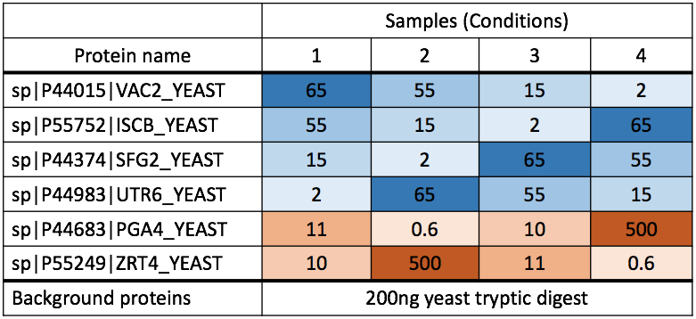
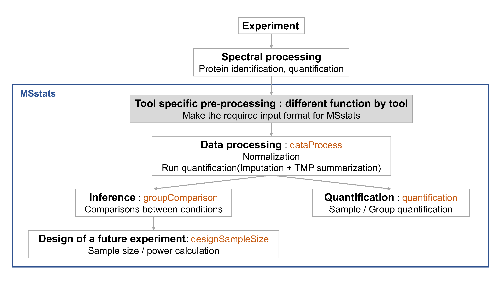
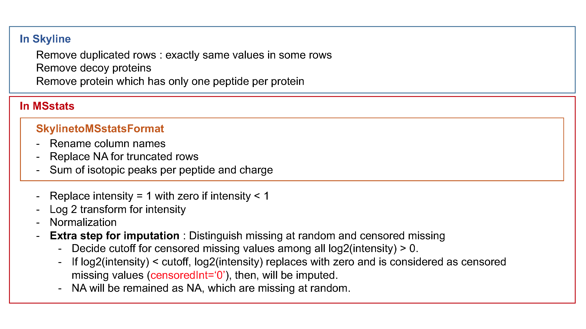
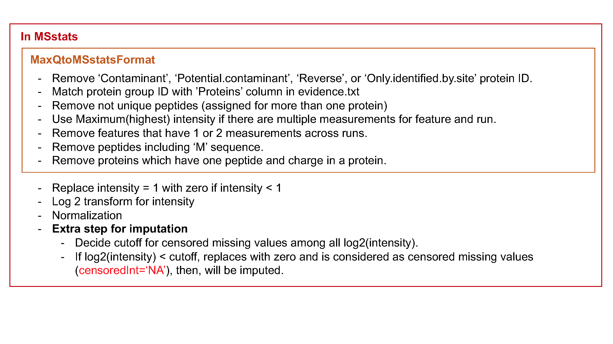
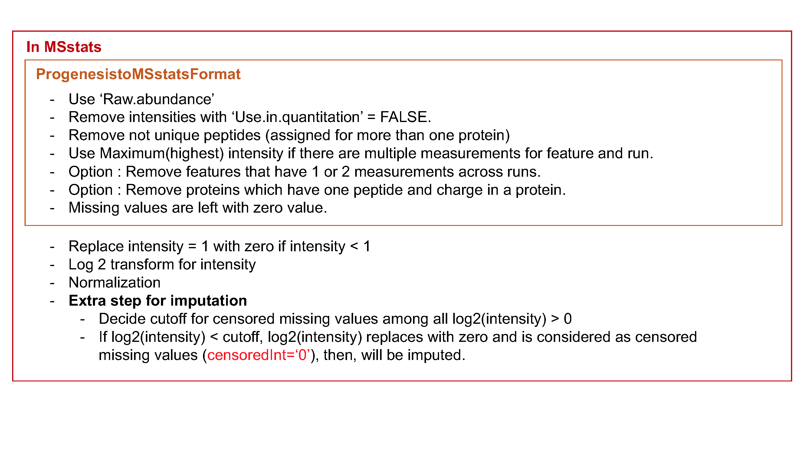
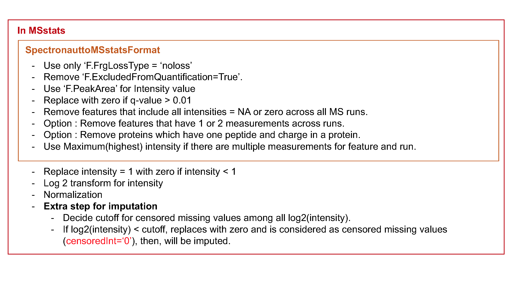

```{r setup, include=FALSE}
knitr::opts_chunk$set(echo = TRUE)
```

# Objective

- Preprocessing steps to make required input format for MSstats from output from diverse output of spectral processing tools.
- Make annotation file, based on experimental design.


***


# Data
- the quantified peak intensities data from ABRF 2015, processed by Skyline.




***

# 1. Load MSstats

Load MSstats first. Then you are ready to start MSstats. 

```{r, eval=F, echo=T, warning=F}
library(MSstats)
?MSstats
```

```{r, eval=T, echo=F, warning=F}
#library(MSstats, warn.conflicts = F, quietly = T, verbose = F)
library(MSstats)

?MSstats
```


***

# 2. Allowable data formats

`MSstats` performs statistical analysis steps, that follow peak identification and quantitation. Therefore, input
to MSstats is the output of other software tools (such as `Skyline`, `MaxQuant` and so on) that read raw spectral files
, identify and quantify spectral peaks. The preferred structure of data for use in MSstats is a .csv file
in a *long* format with at least 10 columns representing the following variables: **ProteinName**, **PeptideSequence**, **PrecursorCharge**, **FragmentIon**, **ProductCharge**, **IsotopeLabelType**, **Condition**, **BioReplicate**, **Run**, **Intensity**. The variable names are fixed, but are case-insensitive.

```{r, eval=T, echo=F, warning=F}
head(DDARawData)
```


***
Let's start preprocessing steps to make required input format for MSstats from output from diverse output of spectral processing tools.




# 3. Skyline output

## 3.1 Read data

The required input data is generated automatically when using `MSstats` report format in `Skyline`.
We first load and access the dataset processed by `Skyline`. The name of saved file from `Skyline` using `MSstats report format` is *'ABRF2015_Skyline_report.csv'*. or you can use the published data from this link (https://panoramaweb.org/labkey/project/MacCoss/brendan/manuscripts/iPRG%202015/begin.view). This example dataset is the exactly same data in 'iPRG_10ppm_2rt_15cut_nosingle.csv' from the link above.


```{r}
# Read output from skyline 
raw.skyline <- read.csv(file="data_Skyline/ABRF2015_Skyline_report.csv")
```

```{r}
# Check the first 6 rows of dataset
head(raw.skyline)
```

There are some column named differently than required input. The information for `Condition` and `BioReplicate` is missing. Let's do preliminary check for this input.

```{r}
# total number of unique protein name
length(unique(raw.skyline$Protein))

# several isotopic peaks for peptide charge
unique(raw.skyline$FragmentIon)

# unique FileName, which is MS run.
unique(raw.skyline$FileName)

# 'Truncated' column
unique(raw.skyline$Truncated)

# count table for 'Truncated' column
xtabs(~Truncated, raw.skyline)

# count which 'Truncated' is 'True'
sum(raw.skyline$Truncated == 'True')
```


## 3.2. Set annotation file

Annotation information is required to fill in **Condition** and **BioReplicate** for corresponding **Run** information. Users have to prepare as csv or txt file like 'ABRF2015_Skyline_annotation.csv', which includes **Run**, **Condition**, and **BioReplicate** information, and load it in R.

```{r}
annot.skyline <- read.csv(file="data_Skyline/ABRF2015_Skyline_annotation.csv")
annot.skyline
```


### 3.2.1 Common mistake for annotation file : Incorrect Run information

Raw file name in the output of spectral processing tool is commonly long. We can make a typo in annotation file. If Raw file name and Run information are not matched, 

Let's check whether **Run** information is same as **File.Name** in output of `Skyline`.

```{r}
setdiff(unique(raw.skyline$FileName), annot.skyline$Run)
setdiff(annot.skyline$Run, unique(raw.skyline$FileName))
```
There is no issue in this annotation. 

Let's try the example with unmatched information.

```{r}
annot.wrong <- read.csv(file="data_Skyline/ABRF2015_Skyline_annotation_wrong_example.csv")
annot.wrong
```


### 3.2.2 Common mistake for annotation file : Incorrect `BioReplicate` information

`MSstats` distinguish the design of experiment as group comparison, time course, paired design, with the combination of `Condition`, `BioReplicate`, and `Run`.


#### Group comparison 
In a group comparison design, the conditions (e.g., disease states) are profiled across **non-overlapping sets of biological replicates (i.e., subjects)**. In this example there are 2 conditions, Disease and Control (in general the number of conditions can vary). There are 3 subjects (i.e., biological replicates) per condition (in general an equal number of replicates per condition is not required). Each subject has 2 technical replicate
runs (in general technical replicates are not required, and their number per sample may vary). Overall, in this example there are 2 × 3 × 2 = 12 mass spectrometry runs.

`Condition` | `BioReplicate` |  `Run` 
------------|----------------|---------
Disease	|		Subject1	|		1
Disease	|		Subject1	|		2
Disease	|		Subject2	|		3
Disease	|		Subject2	|		4
Disease	|		Subject3	|		5
Disease	|		Subject3	|		6
Control |		Subject4	|		7
Control	|		Subject4	|		8
Control	|		Subject5	|		9
Control	|		Subject5	|		10
Control	|		Subject6	|		11
Control	|		Subject6	|		12

The most important is that 1) subject IDs for disease group are completely different thatn subject IDs for control group 2) `Run` is not order of spectral acquisition, but just unique MS run ID.

#### Time course

The important feature of a time course experimental design is that **a same subject (i.e., biological replicate) is repetitively measured across multiple time points**. In this example there are 2 time points, Time1 and Time2 (in general the number of times can vary). There are 4 subjects (i.e., biological replicates) measured across times (in general an equal number of times per replicate is not required). There are no technical replicates (in general the number of technical replicates per sample may vary). Overall, in this example there are 2 × 4 × 1 = 8 mass spectrometry runs.

`Condition` |   `BioReplicate`|	 	`Run`
------------|----------------|---------
Time1	|		Subject1	|		1
Time2	|		Subject1	|		2
Time1	|		Subject2	|		3
Time2	|		Subject2	|		4
Time1	|		Subject3	|		5
Time2	|		Subject3	|		6
Time1	|		Subject4	|		7
Time2	|		Subject4	|		8


#### Paired design

Another frequently used experimental design is a *paired design*, where measurements from **multiple conditions (such as healthy biopsy and disease biopsy) are taken from a same subject**. The statistical model for this experimental design is the same as in the time course experiment, however the values in the columns of the input data may have a different appearence. In this example there are 2 subjects, PatientA and PatientB (in general the number of patients can vary). There are two conditions per subject, BiopsyHealthy and BiopsyTumor (in general the number of conditions per subject can exceed two). In this example there are 3 technical replicates of each type (in this example, the technical replicates are biopsies; in general these can also be replicate sample preparations or replicate mass spectrometry runs). Overall, in this example there are $2  \times 2 \times 3 = 12$ mass spectrometry runs. 


`Condition` |  `BioReplicate` |   	`Run` 
------------|----------------|---------
BiopsyHealthy |		PatientA	|		1
BiopsyHealthy	|		PatientA	|		2
BiopsyHealthy	|	PatientA	|		3
BiopsyTumor	|		PatientA	|		4
BiopsyTumor	|		PatientA	|		5
BiopsyTumor	|		PatientA	|		6
BiopsyHealthy	|		PatientB	|		7
BiopsyHealthy |		PatientB	|		8
BiopsyHealthy	|		PatientB  |		9
BiopsyTumor	|		PatientB	|		10
BiopsyTumor	|		PatientB	|		11
BiopsyTumor	|		PatientB	|		12


## 3.3. Preprocessing with `SkylinetoMSstatsFormat`

The input data for `MSstats` is required to contain variables of **ProteinName**, **PeptideSequence**, **PrecursorCharge**, **FragmentIon**, **ProductCharge**, **IsotopeLabelType**, **Condition**, **BioReplicate**, **Run**, **Intensity**. These variable names should be fixed. `MSstats` input from Skyline adapts the column scheme of the dataset so that it fits `MSstats` input format. However there are several extra column names and also some of them need to be changed.  `SkylinetoMSstatsFormat` function helps pre-processing for making right format of MSstats input from Skyline output. For example, it renames some column name, and replace truncated peak intensities with NA. Another important step is to handle isotopic peaks before using `dataProcess`. The output from Skyline for DDA experiment has several measurements of peak area from the monoisotopic, M+1 and M+2 peaks. To get a robust measure of peptide intensity, we can sum over isotopic peaks per peptide or use the highest peak. Here we take a summation per peptide ion.

Here is the summary of pre-processing steps in `SkylinetoMSstatsFormat` function (in orange box below).




For further details, visit the help file using the following code.
```{r, eval=F}
?SkylinetoMSstatsFormat
```


```{r}
# reformating and pre-processing for Skyline output.
input.skyline <- SkylinetoMSstatsFormat(raw.skyline, annotation=annot.skyline)
head(input.skyline)
```

## 3.4 Preliminary check

```{r}
length(unique(input.skyline$ProteinName)) 
sum(is.na(input.skyline$Intensity)) 
sum(!is.na(input.skyline$Intensity) & input.skyline$Intensity==0)
```


***

# 4. MaxQuant output

## 4.1 Read data

Three files should be prepared before MSstats. Two files, ‘proteinGroups.txt’ and ‘evidence.txt’ are outputs
from MaxQuant.

```{r}
# First, get protein ID information
proteinGroups <- read.table("data_MaxQuant/proteinGroups.txt", sep = "\t", header = TRUE)
```

```{r}
# 3. Read in MaxQuant file: evidence.txt
evi <- read.table("data_MaxQuant/evidence.txt", sep="\t", header=TRUE)
colnames(evi)
unique(evi$Raw.file)
```

One file is for annotation information, required to fill in Condition and BioReplicate for corresponding Run information. Users have to prepare as csv or txt file like ‘ABRF2015_MaxQuant_annotation.csv’, which includes **Run**, **Condition**, and **BioReplicate** information, and load it in R.


## 4.2 Set annotation file

Annotation information is required to fill in **Condition** and **BioReplicate** for corresponding **Raw.file** information. Users have to prepare as csv or txt file like 'ABRF2015_MaxQuant_annotation.csv', which includes **Raw.file**, **Condition**, and **BioReplicate** information, and load it in R. **Raw.file** column in the annotation file should be the same as unique **Raw.file** in evidence.txt file.

```{r}
# Read in annotation including condition and biological replicates: annotation.csv
annot.maxquant <- read.csv("data_MaxQuant/ABRF2015_MaxQuant_annotation.csv", header = TRUE)
annot.maxquant
```


## 4.3 Preprocessing with `MaxQtoMSstatsFormat`

`MaxQtoMSstatsFormat` function helps pre-processing for making right format of MSstats input from MaxQuant output. Basically, this function gets peptide ion intensity from `‘evidence.txt’` file. In addition, there are several steps to filter out or to modify the data in order to get required information.

Here is the summary of pre-processing steps in `MaxQtoMSstatsFormat` function (in orange box below).



```{r, eval=F}
?MaxQtoMSstatsFormat
```

```{r}
# reformating and pre-processing for MaxQuant output.
# no protein with 1 peptide
input.maxquant <- MaxQtoMSstatsFormat(evidence=evi, 
                                      annotation=annot.maxquant,
                                      proteinGroups=proteinGroups,
                                      removeProtein_with1Peptide=TRUE)
head(input.maxquant)
```


## 4.4 Preliminary check

```{r}
length(unique(input.maxquant$ProteinName)) 
sum(is.na(input.maxquant$Intensity)) 
sum(!is.na(input.maxquant$Intensity) & input.maxquant$Intensity==0)
```

> ### Challenge
> 
> * Let's check unique information for `Run`,`BioReplicate` and `Condition` in `input.maxquant`.

```{r}
unique(input.maxquant[, c('Run', 'BioReplicate', 'Condition')])
```


***

# 5. Progenesis output

## 5.1. Read data

```{r}
# First, read output of Progenesis
raw.progenesis <- read.csv("data_Progenesis/ABRF2015_Progenesis_raw.csv", stringsAsFactors=F) # the data file
head(raw.progenesis)
```


One file is for annotation information, required to fill in Condition and BioReplicate for corresponding Run information. Users have to prepare as csv or txt file like ‘ABRF2015_Progenesis_annotation.csv’, which includes **Run**, **Condition**, and **BioReplicate** information, and load it in R.


## 5.2. Set annotation file

Annotation information is required to fill in **Condition** and **BioReplicate** for corresponding **Run** information. Users have to prepare as csv or txt file like 'ABRF2015_Progenesis_annotation.csv', which includes **Run**, **Condition**, and **BioReplicate** information, and load it in R.

```{r}
## Read in annotation including condition and biological replicates: ABRF2015_Progenesis_annotation.csv
annot.progenesis <- read.csv("data_Progenesis/ABRF2015_Progenesis_annotation.csv", header = TRUE)
annot.progenesis
```
!! `Run` information should be the same as annotated in output of `Progenesis`.


## 5.3. Preprocessing with `ProgenesistoMSstatsFormat`

The output from `Progenesis` includes peptide ion-level quantification for each MS runs. `ProgenesistoMSstatsFormat` function helps pre-processing for making right format of `MSstats` input from `Progenesis` output. Basically, this function reformats wide format to long format. It provide **Raw.abundance**, **Normalized.abundance** and **Spectral count** columns. This converter uses **Raw.abundance** columns for Intensity values. In addition, there are several steps to filter out or to modify the data in order to get required information.
Here is the summary of pre-processing steps in `ProgenesistoMSstatsFormat` function (in orange box below).



```{r, eval=F}
?ProgenesistoMSstatsFormat
```

```{r}
# reformating and pre-processing for Progenesis output.
input.progenesis <- ProgenesistoMSstatsFormat(raw.progenesis, 
                                              annotation=annot.progenesis,
                                              removeProtein_with1Peptide=TRUE)

## now 'input.progenesis' is ready for MSstats
head(input.progenesis)
```


## 5.5. Preliminary check for preprocessed data

```{r}
length(unique(input.progenesis$ProteinName)) 
sum(is.na(input.progenesis$Intensity)) 
sum(!is.na(input.progenesis$Intensity) & input.progenesis$Intensity==0)
table(input.progenesis$Run)
```

> ### Challenge
> 
> * Let's check unique information for `Run`,`BioReplicate` and `Condition`.
```{r}
unique(input.progenesis[, c('Run', 'BioReplicate', 'Condition')]) 
```

***


# 6. Spectronaut output

This section describes steps and considerations to properly format data processed by `Spectronaut` for
SWATH/DIA experiments, prior to the `MSstats` analysis. In the following example, the same raw files in
section 5.2 for profiling standard sample set (Bruderer et al. 2015) are quantified by Spectronaut.

## 6.1 Read data
We first load and access the dataset processed by `Spectronaut`.

```{r, eval=FALSE}
# Read output from skyline : Bruderer2015.SN10.xls
raw.SN <- read.csv("data_SN/Bruderer2015.SN10.xls", sep="\t")
```

```{r, echo=FALSE}
load('raw.SN.RData')
```

```{r}
head(raw.SN)
```


**R.Condition** and **R.Replicate** for corresponding **Raw.file** information. Those two information can be assigned in `Spectronaut`.  

## 6.2 Preprocessing with `SpectronauttoMSstatsFormat`

The input data for MSstats is required to contain variables of **ProteinName**, **PeptideSequence**,
**PrecursorCharge**, **FragmentIon**, **ProductCharge**, **IsotopeLabelType**, **Condition**, **BioReplicate**, **Run**, **Intensity**. These variable names should be fixed. Therefore, we need to get subset of useful columns and to rename them. Also several filtering steps are required. `SpectronauttoMSstatsFormat` function helps pre-processing for making right format of `MSstats` input from `Spectronaut` output. First, it uses only noloss from **F.FrgLossType**. If not, multiple measurements for each feature and run can be happend. `Spectronaut` provides the column named **F.ExcludedFromQuantification** based on XIC quality such as interference between chromatographies. Only features with **F.ExcludedFromQuantification == 'False'** should be used. **PG.ProteinGroups** is used for **ProteinName**. **EG.ModifiedSequence** is used for **PeptideSequence**. **FG.Charge** is used for **PrecursorCharge**. **F.FrgIon** is used for **FragmentIon**. **F.Charge** is used for **ProductCharge**. **F.PeakArea** with default option is used for **Intensity**. Then several filtering steps will be performed. Here is the summary of pre-processing steps for SWATH/DIA experiment in `SpectronauttoMSstatsFormat`
function (in orange box below).



`SpectronauttoMSstatsFormat` function helps pre-processing for making right format of `MSstats` input from `Spectronaut` output. Basically, this function gets `MSstats` format output from `Spectronaut`. In addition, there are several steps to filter out or to modify the data in order to get required information.

Here is the summary of pre-processing steps in `SpectronauttoMSstatsFormat` function (in orange box below).

```{r, eval=F}
?SpectronauttoMSstatsFormat
```

```{r}
# reformating and pre-processing for Spectronaut output.
input.SN <- SpectronauttoMSstatsFormat(raw.SN)
head(input.SN)
```


## 5.5. Preliminary check for preprocessed data

```{r}
length(unique(input.SN$ProteinName)) 
sum(is.na(input.SN$Intensity)) 
sum(!is.na(input.SN$Intensity) & input.SN$Intensity==0)
```

***

# 7. Save your work

We can save the data that we made so far.

```{r}
save(input.skyline, file='./data_Skyline/input.skyline.rda')
save(input.maxquant, file='./data_MaxQuant/input.maxquant.rda')
save(input.progenesis, file='./data_Progenesis/input.progenesis.rda')
save(input.SN, file='./data_SN/input.SN.rda')

```


