```{r setup, include=FALSE}
knitr::opts_chunk$set(echo = TRUE)
```


## Data
- The pre-processed data, `input.skyline.rda`, `input.maxquant.rda`, `input.progenesis.rda` from [section 1](https://github.com/MayInstitute/MayInstitute2017/blob/master/Program5_Stat%20for%20MS/MayInst_P5_sec1.html) 


***
# Process with processed Skyline data

Let's start processing steps. It includes log transformation of intensities, normalization and run-level summarization.

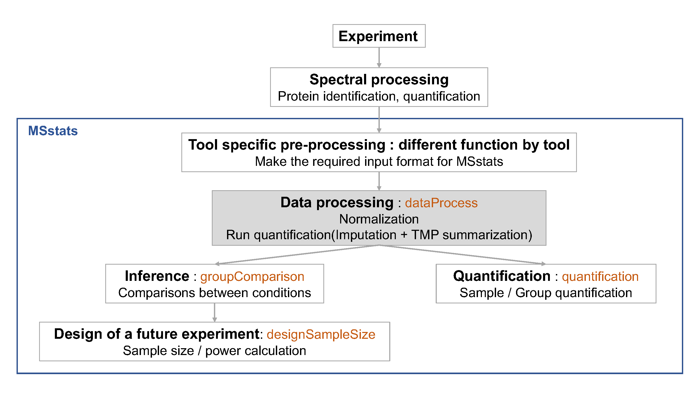

***
## 0. Load the pre-processed data of Skyline output

Load MSstats first. Then you are ready to start MSstats. 

```{r, eval=F, echo=T, warning=F}
library(MSstats)
?MSstats
```

```{r, eval=T, echo=F, warning=F}
#library(MSstats, warn.conflicts = F, quietly = T, verbose = F)
library(MSstats)

?MSstats
```

## 1. Load the pre-processed data of Skyline output

```{r, echo=T}
load(file='./backup/data_Skyline/input.skyline.rda')
```


## 2. Normalizing and summarizing data with dataProcess
**! Always pay attention to the default options **  

After reading the datasets, `MSstats` performs 

* 1) logarithm transformation of `Intensity` column

* 2) normalization

* 3) feature selection, (all features vs subset of features) 

* 4) imputation for censored missing value, which are below the cutoff and undetectable 

* 5) run-level summarization


To get started with this function, visit the help section of `dataProcess` first: 

```{r,eval=FALSE}
?dataProcess
```

### Default normalization and summarization options

`dataProcess` perform (1) normalization first. The default option for normalization is `equalizeMedians`. `equalizeMedians' fits for label-based SRM experiments, which we can use reference signals. There are three more options for normalization. Depending on the suitable assumption for your experiment, you can choose one of them.

Then, (2) run level summarization will be performed including missing value imputation by accerelated failure model and robust parameter estimation by TMP (Tukey's median polish).

Below show the default for all options in dataProcess except `censoredInt`. `censoredInt='0'` should be used for Skyline output.

```{r, eval=F, message=F, warning=F}
quant.skyline <- dataProcess(raw = input.skyline, 
                             logTrans=2, 
                             normalization = 'equalizeMedians',
                             summaryMethod = 'TMP', 
                             MBimpute=TRUE,
                             censoredInt='0',
                             cutoffCensored='minFeature',
                             maxQuantileforCensored = 0.999)
```

```{r, echo=F, eval=F, echo=F, message=F, warning=F}
save(quant.skyline, file='./data_skyline/quant.skyline.RData')
```

```{r, echo=F, message=F, warning=F}
load('./backup/data_Skyline/quant.skyline.rda')
```


Let's check output from `dataProcess`.

```{r, eval=T, echo=T}
# show the name of outputs
names(quant.skyline)

# show reformated and normalized data.
# 'ABUNDANCE' column has normalized log2 transformed intensities.
head(quant.skyline$ProcessedData)

# This table includes run-level summarized log2 intensities. (column : LogIntensities)
# Now one summarized log2 intensities per Protein and Run.
# NumMeasuredFeature : show how many features are used for run-level summarization.
#         If there is no missing value, it should be the number of features in certain protein.
# MissingPercentage : the number of missing features / the number of features in certain protein.
head(quant.skyline$RunlevelData)

# show which summarization method is used.
head(quant.skyline$SummaryMethod)
```


***


## 3. Visualization of processed data

### 3.1. Quality control plots

Now let's look at what the equalize medians procedure did to our data. QC plot is good to see the distribution of intensities per MS run and outliers. So, it is good visualization to check normalization. However, not good to see individual intensities.

```{r, eval=F, message=F, warning=F}
# QC plot for normalized data with equalize median method
dataProcessPlots(data = quant.skyline, 
                 type="QCplot", 
                 width=7, height=7,
                 which.Protein = 1,
                 address='./data_Skyline/ABRF_skyline_equalizeNorm_')
```
Then, `ABRF_skyline_equalizeNorm_QCPlot.pdf` are generated in the currect directory.

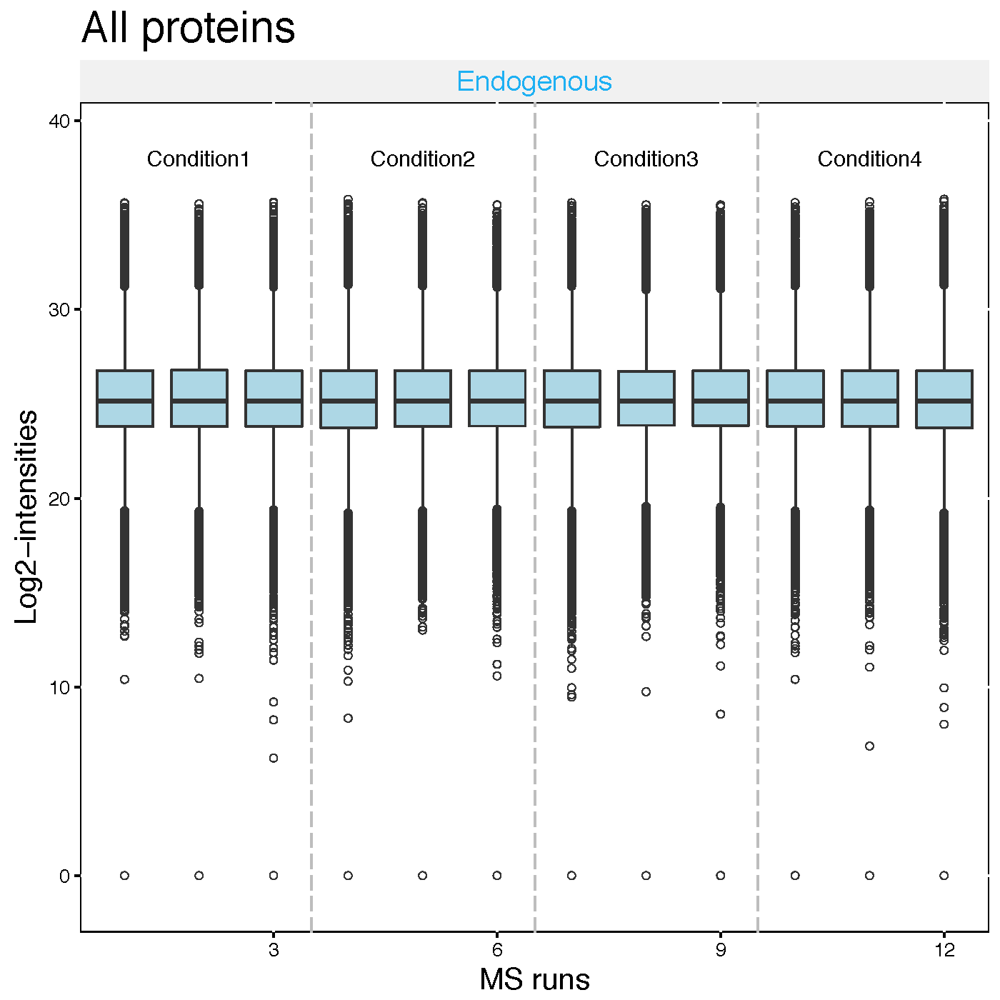


Now the median log2 intensities per run across MS runs (lines in the boxes) are the same. 


### 3.2. Profile plots

Profile plot is good visualization to check individual measurements. Each dot means one intensity. The dots are linked with line per feature. If line is disconnected, that means there is no value (missing value). Color means different peptides and charge stages. Different line type means different transition. 


```{r, eval=F}
# if you have many MS runs, adjust width of plot (makd wider)
# Profile plot for the data with equalized median method
dataProcessPlots(data = quant.skyline, 
                 type="Profileplot", 
                 width=7, height=7,
                 address="./data_Skyline/ABRF_skyline_equalizeNorm_")
```

`ABRF_skyline_equalizeNorm_ProfilePlot.pdf` and `ABRF_skyline_equalizeNorm_ProfilePlot_wSummarization.pdf` are generated in the current directory.

Then, Let's go though profile plots to see overall quality of data.

There are two pdfs for each protein, first is profile plot with normalized data and second plot is profile plot with normalilzed data and summarized data. This profile plot shows each peptide transition across runs, grouped per condition. Ech peptide has a different colour/type layout. 

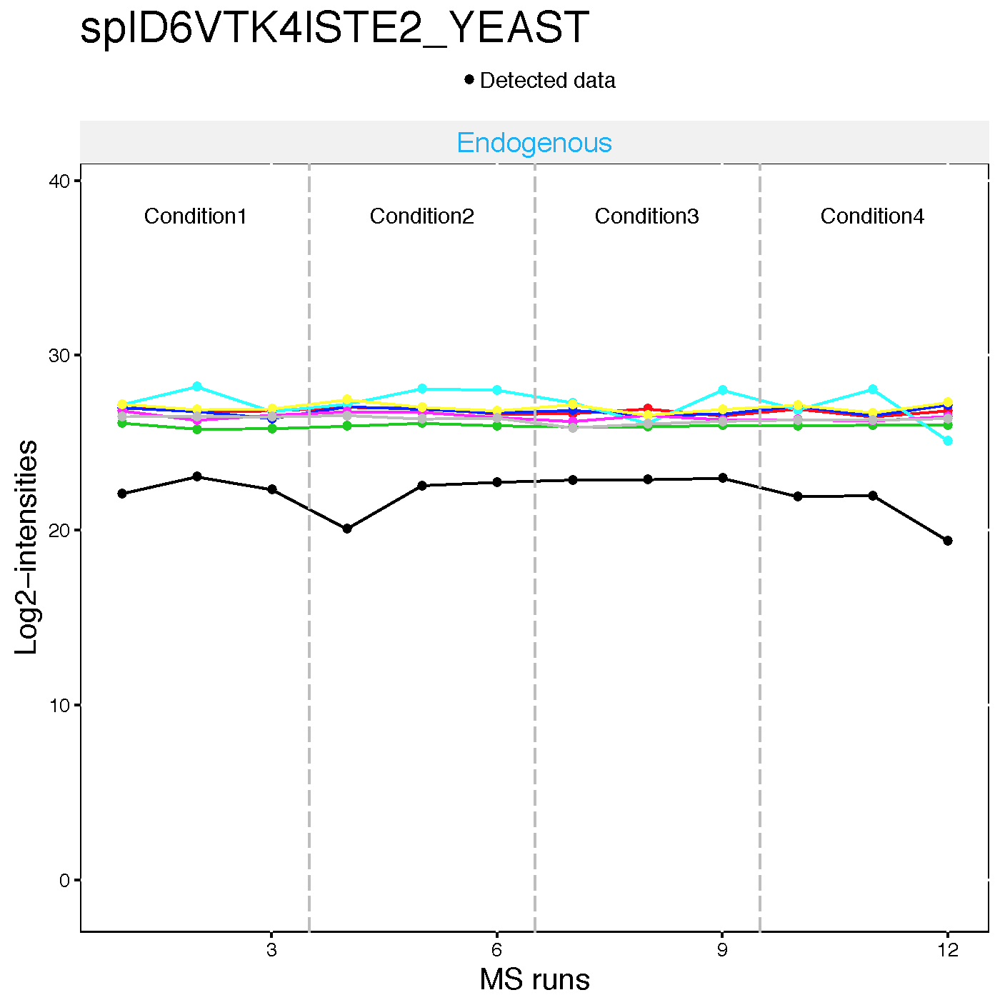


This plot shows The panel on the right shows the same transitions in grey, with the values as summarized by the model overlayed in red.


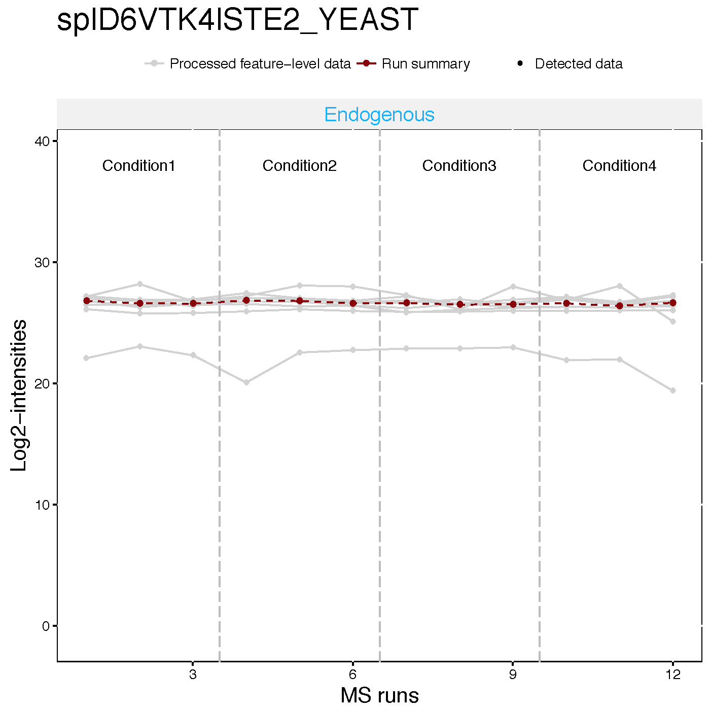


Instead of making all profile plots for all proteins, we can make plot for individual protein.
Here is the example of spike-in protein, `sp|P44015|VAC2_YEAST`
```{r, eval=FALSE}
dataProcessPlots(data = quant.skyline, 
                 type="Profileplot", 
                 featureName="NA",
                 width=7, height=7,
                 which.Protein = 'sp|P44015|VAC2_YEAST',
                 address="./data_Skyline/ABRF_skyline_equalizeNorm_P44015_")
```

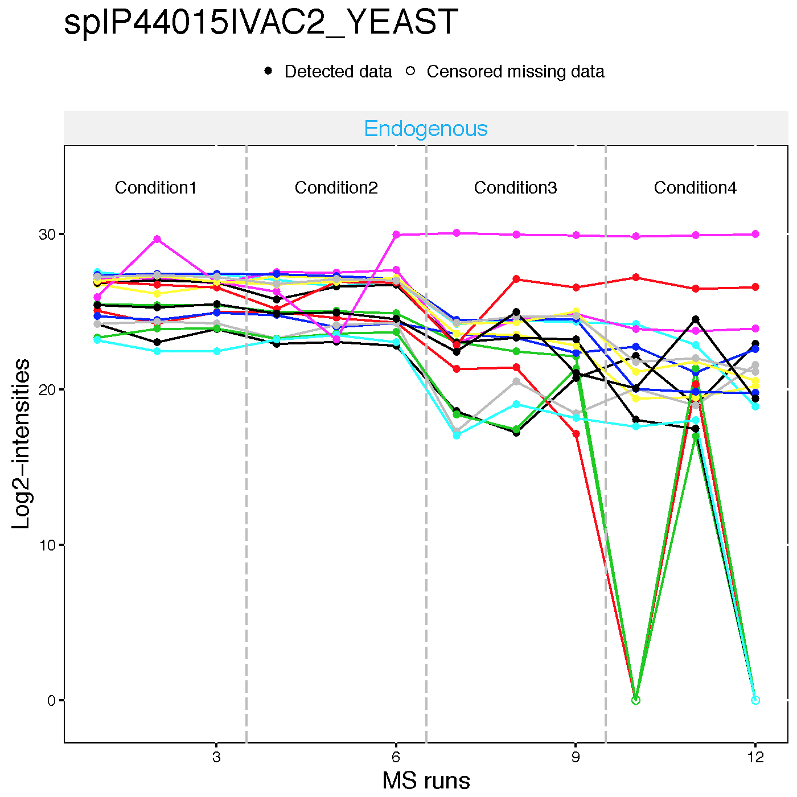


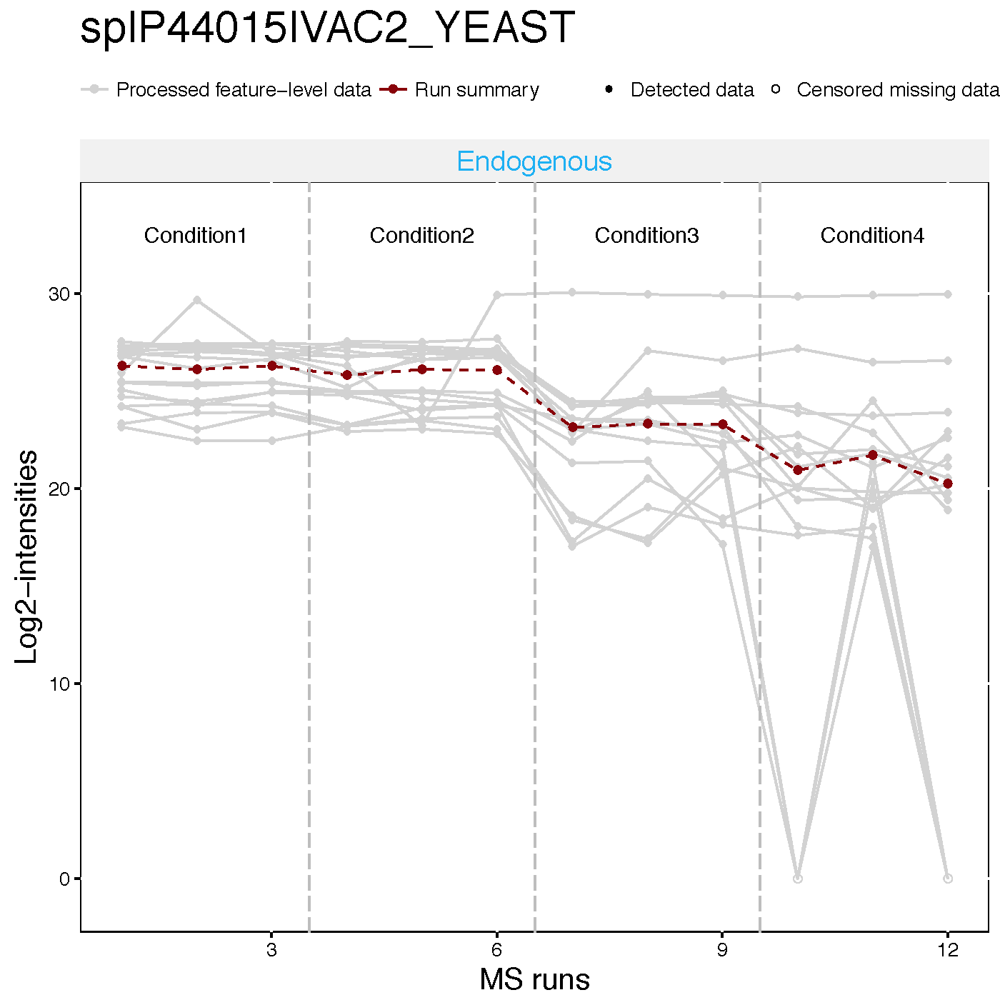


### 3.3. Condition plots

Condition plots illustrate the systematic difference between conditions. The dots indicates the mean of all summarized intensities in each condition and default error bar is CI with 0.95 significant level. However, it is not related with model-based analysis.


```{r, eval=F}
dataProcessPlots(data = quant.skyline, 
                 type="conditionplot", 
                 width=7, height=7,
                 address="./data_Skyline/ABRF_skyline_equalizeNorm_")
```

We can draw the condition plot for a protein, `sp|P44015|VAC2_YEAST` .

```{r, eval=F}
dataProcessPlots(data = quant.skyline, 
                 type="conditionplot", 
                 width=7, height=7,
                 which.Protein = 'sp|P44015|VAC2_YEAST',
                 address="./data_Skyline/ABRF_skyline_equalizeNorm_P44015_")
```


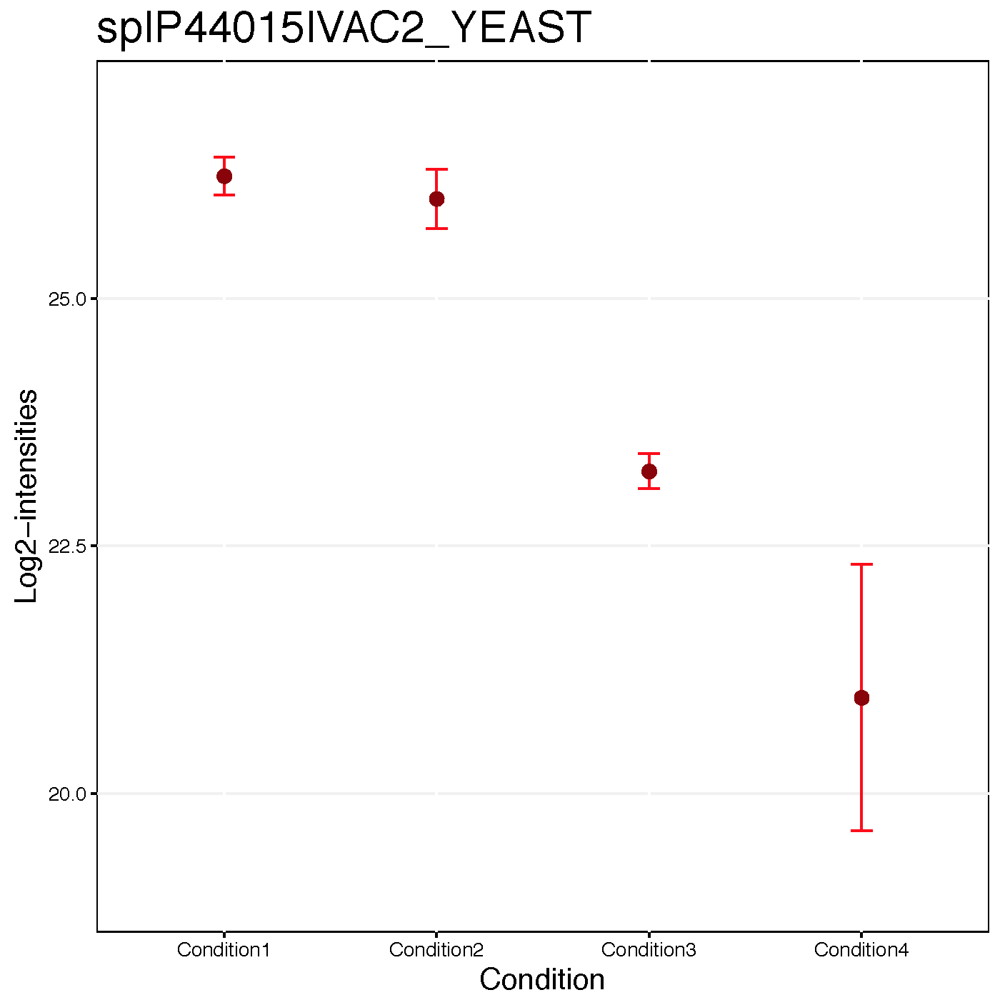


> **Challenge**
>
> This is the study design. Let's check visualization for other 5 spike-in proteins.
> 1. sp|P55752|ISCB_YEAST
> 2. sp|P44374|SFG2_YEAST
> 3. sp|P44983|UTR6_YEAST
> 4. sp|P44683|PGA4_YEAST
> 5. sp|P55249|ZRT4_YEAST


***

## 4. Different normalization option
Let's see the different normalization effect with SRM dataset including two proteins

```{r}
head(SRMRawData)
unique(SRMRawData$ProteinName)
```

### 4.1. No normalization
No normalization is performed. If you had your own normalization before `MSstats`, you should use like below.
```{r, eval=FALSE}
srm.nonorm <- dataProcess(SRMRawData, normalization=FALSE)
dataProcessPlots(srm.nonorm, type='QCplot', address='srm_noNorm_')
```

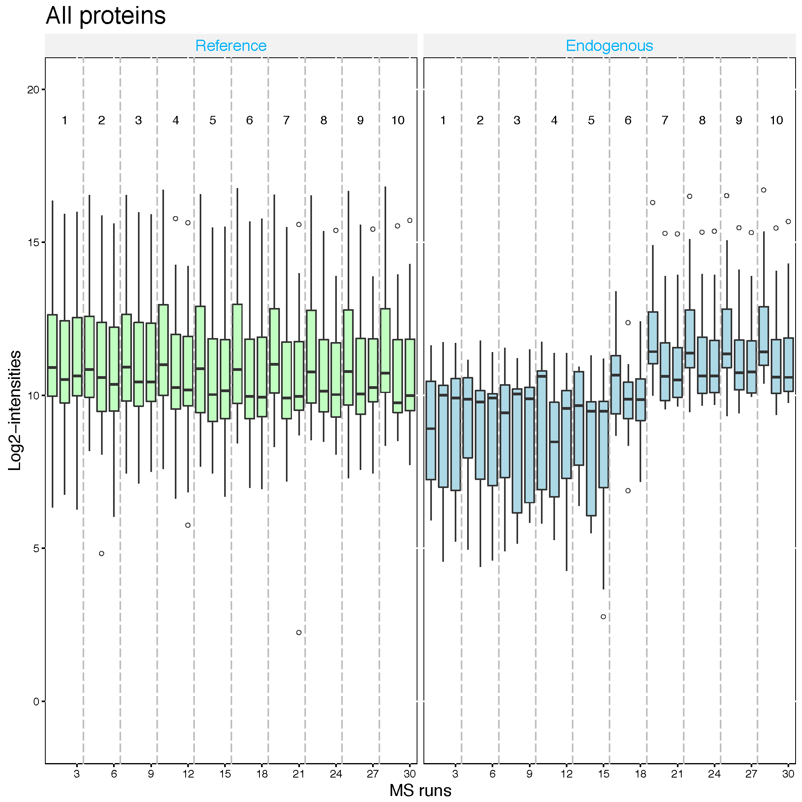

### 4.2. Equalize medians normalization
The default option for normalization is 'equalizeMedians', where all the
intensities in a run are shifted by a constant, to equalize the median of intensities across runs for
label-free experiment. This normalization method is appropriate **when we can assume that the
majority of proteins do not change across runs**. Be cautious when using the `equalizeMedians`
option for a label-free DDA dataset with only a small number of proteins. For label based experiment,
`equalizeMedians` equalizes the median of reference intensities across runs and is generally proper
even for a dataset with a small number of proteins.

```{r, eval=FALSE}
srm.equalmed <- dataProcess(SRMRawData, normalization = 'equalizeMedians')
dataProcessPlots(srm.equalmed, type='QCplot', address='srm_equalM_')
```


### 4.3. Quantile normalization
The distribution of all the intensities in each run will become the same across runs for
label-free experiment. For label-based experiment, the distribution of all the reference intensities
will be become the same across runs and all the endogenous intensities are shifted by a constant
corresponding to reference intensities.

```{r, eval=FALSE}
srm.quantile <- dataProcess(SRMRawData, normalization='quantile')
dataProcessPlots(srm.quantile, type='QCplot', address='srm_quantile_')
```

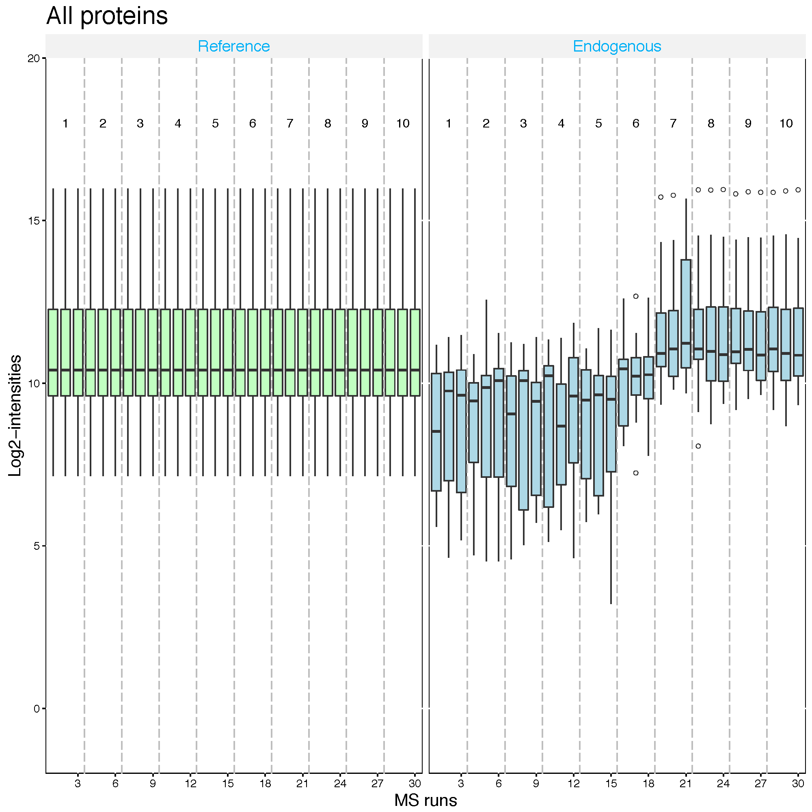

### 4.4. Global standards normalization : example 1
If you have a spiked in standard across all MS runs, you may set this to `globalStandards` and define the standard with `nameStandards` option. Global standard peptide or Protein names, which you can assume that they have the same abundance across MS runs, should be assigned in the vector for this option.

First, let's assume that `PMG2` proteins is the spike-in protein and shoule be equal amount across MS runs.

```{r, eval=FALSE}
srm.global.pmg2 <- dataProcess(SRMRawData, normalization ='globalStandards',
                               nameStandards = 'PMG2')
dataProcessPlots(srm.global.pmg2, type='QCplot', address='srm_global_PMG2_')
```
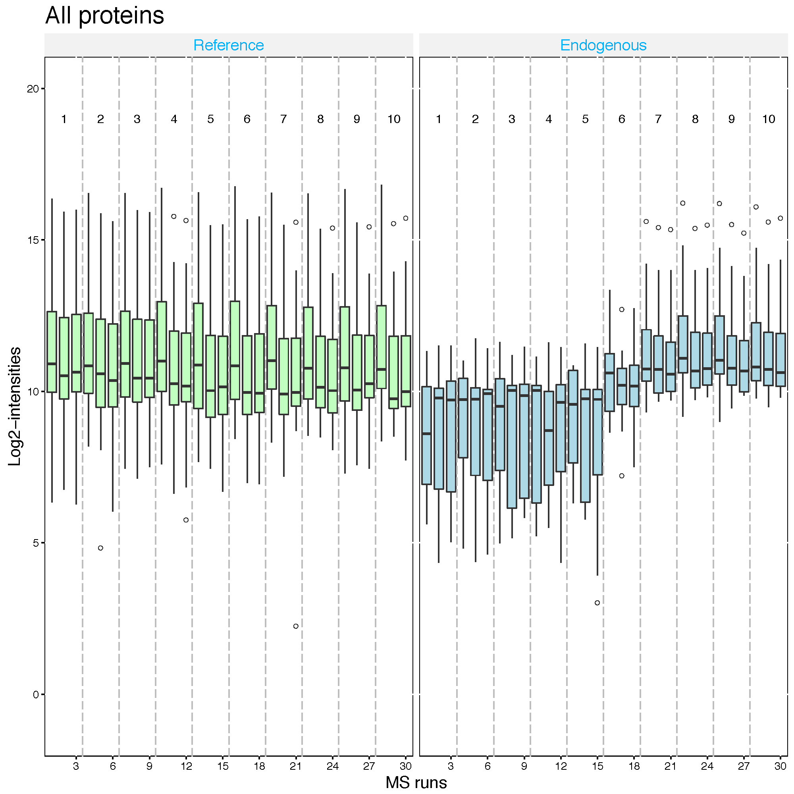


Second, let's assume that `IDHC` proteins is the spike-in protein and shoule be equal amount across MS runs.

### 4.5. Global standards normalization : example 2
```{r, eval=FALSE}
srm.global.idhc <- dataProcess(SRMRawData, normalization ='globalStandards',
                               nameStandards = 'IDHC')
dataProcessPlots(srm.global.idhc, type='QCplot', address='srm_global_IDHC_')
```
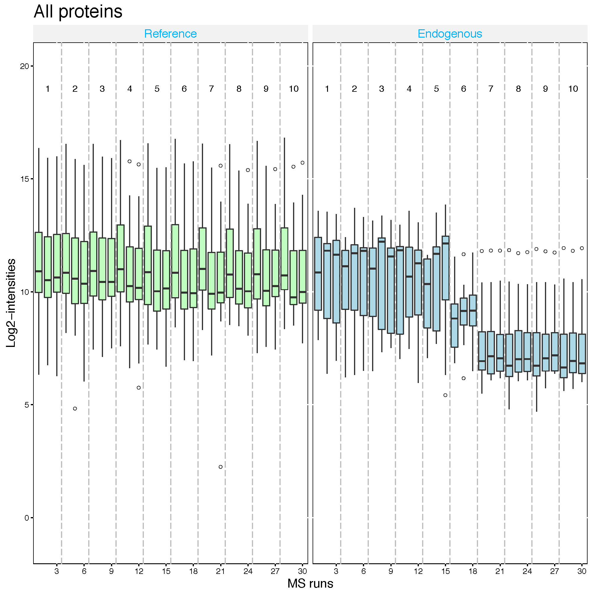


## 5. Different summarization option

Here is the summary of combinations for imputation options with summaryMethod='TMP'.

* MBimpute=TRUE : AFT model-based imputation using `cutoffCensored` value in the AFT model.

* The default option for `cutoffCensored` is `minFeature`, taking the minimum value for the corresponding
feature. With this option, those runs with substantial missing measurements will be biased by
the cutoff value. In such case, you may remove the runs that have more than 50% missing values from the
analysis with the option remove50missing=TRUE.

* In case that there are completely missing measurements in a run for a protein, any imputation
will not be performed.

### 5.1 No imputation, TMP summarization only

```{r, eval=F, message=F, warning=F}
quant.skyline.TMPonly <- dataProcess(raw = input.skyline, 
                                      logTrans=2, 
                                      summaryMethod = 'TMP', 
                                      MBimpute=FALSE,
                                      censoredInt='0',
                                      cutoffCensored='minFeature',
                                      maxQuantileforCensored = 0.999)
```

```{r, echo=F, message=F, warning=F}
load('./backup/data_Skyline/quant.skyline.TMPonly.rda')
```

The column, `censored`, is not in the processed data any more.
```{r}
head(quant.skyline.TMPonly$ProcessedData)
```

Normalization is the same.
```{r, eval=F}
dataProcessPlots(data = quant.skyline.TMPonly, 
                 type="QCplot", 
                 width=7, height=7,
                 which.Protein = 1,
                 address='./data_Skyline/ABRF_skyline_equalizeNorm_TMPonly_')
```

Run summarization is different.
```{r, eval=F}
dataProcessPlots(data = quant.skyline.TMPonly, 
                 type="Profileplot", 
                 featureName="NA",
                 width=7, height=7,
                 which.Protein = 'sp|P44683|PGA4_YEAST',
                 address="./data_Skyline/ABRF_skyline_equalizeNorm_TMPonly_P44683_")
```


***
# Process with processed MaxQuant data

```{r, echo=T}
load(file='./backup/data_MaxQuant/input.maxquant.rda')
```

```{r}
head(input.maxquant)
sum(is.na(input.maxquant$Intensity)) 
sum(!is.na(input.maxquant$Intensity) & input.maxquant$Intensity==0)
```

MaxQuant output has only `NA`. `censoredInt='NA'` should be used for MaxQuant output.

> **Challenges**
>
> 1. Try `dataProcess` with equalize median normalization for MaxQuant output. (`input.maxquant.rda` from section 1)
```{r, echo=T, eval=F, message=F, warning=F}
quant.maxquant <- dataProcess(raw = input.maxquant, 
                                      logTrans=2, 
                                      #normalization = 'quantile',
                                      summaryMethod = 'TMP', 
                                      MBimpute=TRUE,
                                      censoredInt='NA',
                                      cutoffCensored='minFeature',
                                      maxQuantileforCensored = 0.999)
```


> 2. Try `dataProcess` with quantile normalization for MaxQuant output. (`input.maxquant.rda` from section 1)
```{r, echo=T, eval=F, message=F, warning=F}
quant.maxquant.quantile <- dataProcess(raw = input.maxquant, 
                              logTrans=2, 
                              normalization = 'quantile',
                              summaryMethod = 'TMP', 
                              MBimpute=TRUE,
                              censoredInt='NA',
                              cutoffCensored='minFeature',
                              maxQuantileforCensored = 0.999)
```

> 3. Draw QC plots for both cases above and compare.

```{r, echo=T, eval=F, message=F, warning=F}
dataProcessPlots(data = quant.maxquant, 
                 type="QCplot", 
                 width=7, height=7,
                 which.Protein = 1,
                 address='./data_MaxQuant/ABRF_maxquant_equalMed_')

dataProcessPlots(data = quant.maxquant.quantile, 
                 type="QCplot", 
                 width=7, height=7,
                 which.Protein = 1,
                 address='./data_MaxQuant/ABRF_maxquant_quantile_')
```

> 4. Draw Profile plots of protein `P55249`, for both cases above and compare.

```{r, echo=T, eval=F, message=F, warning=F}
dataProcessPlots(data = quant.maxquant, 
                 type="Profileplot", 
                 featureName="NA",
                 width=7, height=7,
                 which.Protein = 'P55249',
                 address="./data_MaxQuant/ABRF_maxquant_equalMed_P55249_")

dataProcessPlots(data = quant.maxquant.quantile, 
                 type="Profileplot", 
                 featureName="NA",
                 width=7, height=7,
                 which.Protein = 'P55249',
                 address="./data_MaxQuant/ABRF_maxquant_quantile_P55249_")
```

***
# Process with processed Progenesis data

```{r, echo=T}
load(file='./backup/data_Progenesis/input.progenesis.rda')
```

```{r}
head(input.progenesis)
sum(is.na(input.progenesis$Intensity)) 
sum(!is.na(input.progenesis$Intensity) & input.progenesis$Intensity==0)
```

Progenesis output has only `0`. `censoredInt='0'` should be used for Progenesis output.

> **Challenges**
>
> 1. Try `dataProcess` with equalize normalization for Progenesis output. (`input.progenesis.rda` from section 1)

```{r, echo=T, eval=F, message=F, warning=F}
quant.progenesis <- dataProcess(raw = input.progenesis, 
                              logTrans=2, 
                              #normalization = 'quantile',
                              summaryMethod = 'TMP', 
                              MBimpute=TRUE,
                              censoredInt='0',
                              cutoffCensored='minFeature',
                              maxQuantileforCensored = 0.999)
```

> 2. Try `dataProcess` with quantile normalization for Progenesis output. (`input.progenesis.rda` from section 1)
```{r, echo=T, eval=F, message=F, warning=F}
quant.progenesis.quantile <- dataProcess(raw = input.progenesis, 
                                       logTrans=2, 
                                       normalization = 'quantile',
                                       summaryMethod = 'TMP', 
                                       MBimpute=TRUE,
                                       censoredInt='0',
                                       cutoffCensored='minFeature',
                                       maxQuantileforCensored = 0.999)
```

> 3. Draw Profile plots of protein `sp|P55249|ZRT4_YEAST`, for both cases above and compare.

```{r, echo=T, eval=F, message=F, warning=F}
dataProcessPlots(data = quant.progenesis, 
                 type="Profileplot", 
                 featureName="NA",
                 width=7, height=7,
                 which.Protein = 'sp|P55249|ZRT4_YEAST',
                 address="./data_Progenesis/ABRF_progenesis_equalMed_P55249_")

dataProcessPlots(data = quant.progenesis.quantile, 
                 type="Profileplot", 
                 featureName="NA",
                 width=7, height=7,
                 which.Protein = 'sp|P55249|ZRT4_YEAST',
                 address="./data_Progenesis/ABRF_progenesis_quantile_P55249_")
```

> 4. Compare profile plots from MaxQuant data.

