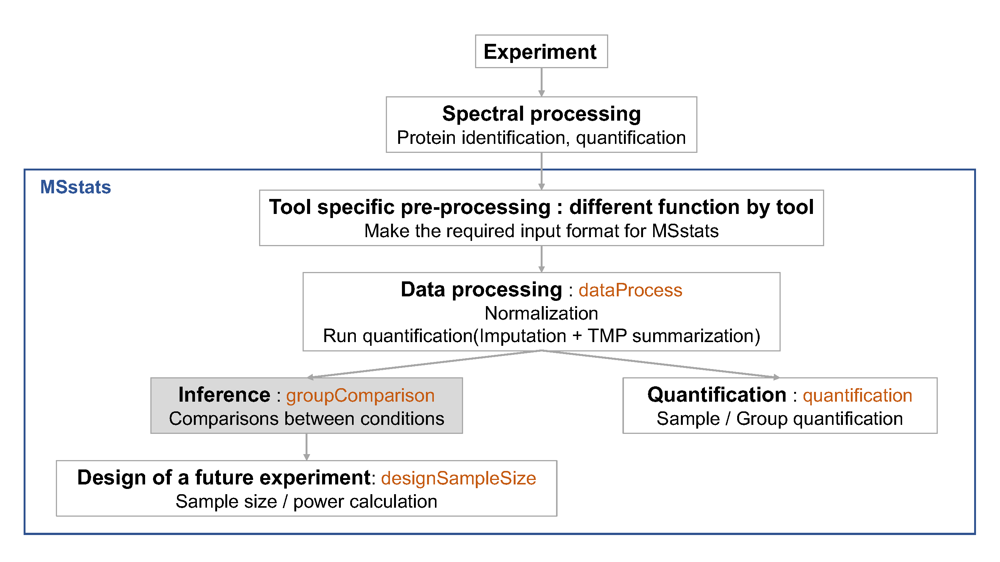
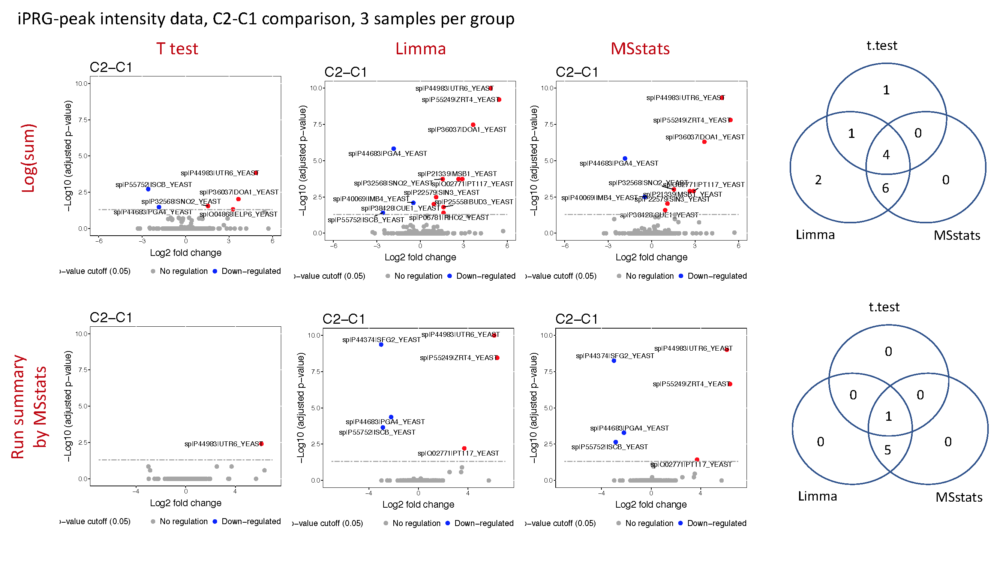

```{r, echo=F, warning=F}
## we're setting up the directory for figures
library(knitr)
opts_chunk$set(fig.path = "./")
opts_chunk$set(fig.align = "center")
```


## Objective

- Compare the results with different statistical methods.
- Significance analysis for MS proteomics based peak count data

***

## Data
- the quantified peak intensities data from ABRF 2015, processed by Skyline.
- the spectral count data from ABRF 2015 is used.


# 1. Example codes for using Limma

We can use `Limma` package, which is popular for microarray datasets. This is for differenrential protein analysis. W need protein-level quantified intensities. Let's use the `$RunlevelData` from `dataProcess` function.




## 1.1 Load the package, `Limma`

`Limma` is available in Bioconductor.
```{r}
library(limma)
## Let's load reshape2 function
library(reshape2)
```

## 1.2 Load the processed Skyline data and reformat

Let's load the processed by `dataProcess` function in MSstats from section 2.
```{r, echo=T}
load(file='./data_Skyline/quant.skyline.rda')
```

We will use run-level summarized data for hypothesis testing.
```{r}
## use run-level summarized value from MSstats
input <- quant.skyline$RunlevelData
head(input)
```

`input` is the long format data. But, we need the wide format data for `Limma`.
```{r}
## Make the wide format data
input.wide <- dcast(Protein ~ originalRUN, data=input, value.var = 'LogIntensities')
head(input.wide)

## annotate protein id in rowname.
rownames(input.wide) <- input.wide$Protein
input.wide <- input.wide[, -1]
head(input.wide)
```

## 1.3 Set comparison matrix

Then, we need to annotate group information for each run.
```{r}
design <- model.matrix(~0+factor(c(1,1,1,2,2,2,3,3,3,4,4,4)))
colnames(design) <- c('Condition1', 'Condition2', 'Condition3', 'Condition4')
design
```

Let's set up what comparisons you want. Try for 3 comparisons, Condition2 vs Condition1, Condition3 vs Condition1, Condition4 vs Condition1.
```{r}
contrast.matrix <- makeContrasts(Condition2-Condition1, 
                                 Condition3-Condition1,
                                 Condition4-Condition1,
                                 levels=design)
contrast.matrix
```

## 1.4. Compare between groups

Fit linear model for each protein.
```{r}
fit <- lmFit(input.wide, design)
class(fit)
names(fit)
fit
```

Given a linear model fit, compute estimated coefficients and standard errors for a given set of contrasts
```{r}
fit2 <- contrasts.fit(fit, contrast.matrix)
```

Given a linear model fit, compute moderated t-statistics, moderated F-statistic, and log-odds of differential abundance by empirical Bayes moderation of the standard errors.
```{r}
fit3 <- eBayes(fit2)
fit3
class(fit3)
names(fit3)
```


## 1.5 Reformat the output

Let's make the table with result.
```{r}
log2FC <- melt(fit3$coefficients)
head(log2FC)
colnames(log2FC) <- c('Protein', 'Label', 'log2FC')

pvalue <- melt(fit3$p.value)
head(pvalue)
colnames(pvalue) <- c('Protein', 'Label', 'pvalue')

test.limma <- merge(log2FC, pvalue, by=c('Protein', 'Label'))
head(test.limma)
```

## 1.6. Calculate adjusted p-value

```{r}
adj.pvalue <- sapply(split(test.limma$pvalue, test.limma$Label),
                                function(x)p.adjust(x, method='BH'))
head(adj.pvalue)
rownames(adj.pvalue) <- unique(test.limma$Protein)
out <- melt(adj.pvalue)
head(out)
colnames(out) <- c('Protein', 'Label', 'adj.pvalue')

test.limma <- merge(test.limma, out, by=c('Protein', 'Label'))
head(test.limma)

save(test.limma, file='./data_Skyline/test.limma.rda')
write.csv(test.limma, file='./data_Skyline/test.limma.csv')
```

Let's draw the volcano plot
```{r}
library(MSstats)

## small trick to use the same volcano plot.
test.limma$issue <- NA

groupComparisonPlots(data=test.limma,
                     type='Volcanoplot',
                     address='Skyline_VolcanoPlot_limma_')
```

> ### Challenge
> 1. Compare the volcano plots from Limma and from MSstats (under ./backup/data_Skyline/testResult_ABRF_skyline_VolcanoPlot.pdf)

> 2. Repeat for different comparison matrix, including Condition3-Condition2, Condition4-Condition2, Condition4-Condition3.
```{r}
contrast.matrix <- makeContrasts(Condition3-Condition2, 
                                 Condition4-Condition2,
                                 Condition4-Condition3,
                                 levels=design)
contrast.matrix

fit <- lmFit(input.wide, design)
fit2 <- contrasts.fit(fit, contrast.matrix)
fit3 <- eBayes(fit2)
```

## 1.7 Compare the result

Let's check how different result between MSstats and Limma.
First, read the result from MSstats. Then, apply 0.05 for adjusted pvalue cutoff for both results.

```{r}
load('./data_Skyline/Skyline.result.rda')

Skyline.msstats.sig <- Skyline.result[Skyline.result$adj.pvalue < 0.05, ]
dim(Skyline.msstats.sig)
unique(Skyline.msstats.sig$Protein) ## 7 proteins

Skyline.limma.sig <- test.limma[test.limma$adj.pvalue < 0.05, ]
dim(Skyline.limma.sig)
unique(Skyline.limma.sig$Protein) ## 9 proteins
```

Let's check the siginficant protein IDs with Venn Diagram.
```{r}
## Venn Diagram for unique proteins
library(gplots)
venn(list(MSstats = unique(Skyline.msstats.sig$Protein), 
          Limma = unique(Skyline.limma.sig$Protein)))
```


There are t.test result, named `test.test.rda`. Let's draw the volcano plot and compare.
```{r}
load('./data_Skyline/test.ttest.rda')

# this is for making the required format 
# in order to use `groupComparisonPlots` function.
test.ttest$issue <- NA 

groupComparisonPlots(data=test.ttest,
                     type='Volcanoplot',
                     address='Skyline_VolcanoPlot_ttest_')

Skyline.ttest.sig <- test.ttest[test.ttest$adj.pvalue < 0.05, ]
dim(Skyline.ttest.sig)
unique(Skyline.ttest.sig$Protein) ## 6 proteins
```

Here is the plots with different run-summarization (log(sum of all intensities in a run) in the first row and MSstats method in the second row) and different testing strategies(t-test in the first column, Limma in the second column, and linear model in MSstats in third column). Venn diagrams shows the overlapped significant protein (with cutoff =0.05 for adjusted pvalue) for condition2 vs condition1 comparison.





***

# 2. Example codes for using DESeq2 for MS Proteomics, ABRF spectral count data

## 2.1 Load count data
```{r}
load('./data_Skyline/iprg.count.rda')
head(iprg.count)
```

## 2.2 Make the count table for spectra
```{r}
iprg.count[iprg.count$Protein == 'sp|D6VTK4|STE2_YEAST' &
               iprg.count$Run == '1A', ]

spec.count <- dcast(Protein ~ Run, data=iprg.count)
head(spec.count)
```

Now `spec.count` has the spectral count per protein and run. Then, make rowname with protein ID and remove the column for protein IDs.

```{r}
countData <- as.matrix(spec.count[,-c(1)])
protName <- as.character(spec.count[,1])      
```

## 2.3 Load the package, DESeq2
```{r, eval=F, echo=T, warning=F}
## DESeq2: NB GLM + Wald test
library(DESeq2)
```

```{r, eval=T, echo=F, warning=F}
library(DESeq2, warn.conflicts = F, quietly = T, verbose = F)
```

## 2.4 Make design matrix 
```{r}
## Format the data for DESeq
## use M1 as reference in the design matrix
groupinfo <- data.frame(Condition1=factor(c(rep(1, 3),rep(0, 9))), 
                      Condition2=factor(c(rep(0, 3), rep(1,3), rep(0, 6))),
                      Condition3=factor(c(rep(0, 6), rep(1,3),rep(0, 3))), 
                      Condition4=factor(c(rep(0, 9), rep(1,3))))
```

## 2.5 Set the desired comparisons
Comparisons with 1st one : Condition2 vs Condition1, Condition3 vs Condition1, Condition4 vs Condition1.  `Design model ~ Condition2+Condition3+Condition4`

```{r}
dds <- DESeqDataSetFromMatrix(countData = countData, 
                              colData = groupinfo, 
                              design = ~ Condition2+Condition3+Condition4)
```

## 2.6 Testing
Test for differential expression with NB distribution and exact test.
```{r}
dds <- DESeq(dds)
dds # object of DESeqDataSet class 
resultsNames(dds)

## block automatic independent filtering after testing
c1vs2 <- results(dds, contrast=c('Condition2', '0', '1'), independentFiltering = FALSE)
c1vs3 <- results(dds, contrast=c('Condition3', '0', '1'), independentFiltering = FALSE)
c1vs4 <- results(dds, contrast=c('Condition4', '0', '1'), independentFiltering = FALSE)
```

## 2.7 Reformat the output
Combine everything and change the format.
```{r}
results_count <- data.frame(rbind(c1vs2, c1vs3, c1vs4))
results_count$Label <- factor(c(rep(c("C2-C1"),dim(spec.count)[1]),
                                rep(c("C3-C1"), dim(spec.count)[1]),
                                rep(c("C4-C1"),dim(spec.count)[1])))
results_count$Protein <- spec.count$Protein

results_count <- results_count[, c(8,7,1,2,3,4,5,6)]
head(results_count)
colnames(results_count)[4] <- 'log2FC'
colnames(results_count)[8] <- 'adj.pvalue'
```

```{r}
## Save the result 
test.count.deseq2 <- results_count
save(test.count.deseq2, file='./data_Skyline/test.count.deseq2.RData')
```

## 2.8 Compare the result

```{r}
load('./data_Skyline/test.count.deseq2.result.all.rda')
head(test.count.deseq2.result.all)
colnames(test.count.deseq2.result.all)[1] <- 'Protein'
colnames(test.count.deseq2.result.all)[3] <- 'log2FC'
colnames(test.count.deseq2.result.all)[7] <- 'adj.pvalue'
test.count.deseq2.result.all$issue <- NA

groupComparisonPlots(data=test.count.deseq2.result.all,
                     type='Volcanoplot',
                     address='Count_VolcanoPlot_DESeq2_')

Skyline.msstats.sig <- Skyline.result[Skyline.result$adj.pvalue < 0.05, ]
dim(Skyline.msstats.sig)
unique(Skyline.msstats.sig$Protein) ## 7 proteins
unique(Skyline.msstats.sig[, c('Protein', 'Label')])

count.deseq.sig <- test.count.deseq2.result.all[test.count.deseq2.result.all$adj.pvalue < 0.05, ]
dim(count.deseq.sig)
unique(count.deseq.sig$protein) ## 6 proteins
unique(count.deseq.sig[, c('Protein', 'Label')])
```


